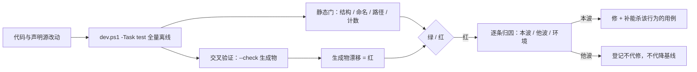

# B10.test-gates 测试与机器门体系

<!-- BOARD-AUTO:BEGIN -->
<!-- 本节由 scripts/board_doc_sync.py 生成，请勿手改；正文写在标记外 -->

## B10.test-gates 测试与机器门体系

> 离线 mock 全量树、契约门、棘轮门与交叉验证。

- 归属板块：[B10](../README.md)
- 实现落点：`tests`

### 三级入口

| 三级入口 | 路由席位 | 能力 id | 别名/帮助页 | 优先级 |
|---|---|---|---|---|
| [渲染与出站契约门](contract-gates.md) | — | — | — | — |
| [棘轮与地板门](ratchet-gates.md) | — | — | — | — |
| [变异注毒自证](mutation-testing.md) | — | — | — | — |
<!-- BOARD-AUTO:END -->

## 这个功能解决什么

回归树 `tests/` 是本仓唯一「不靠自觉」的质量层：**全离线 mock**——不连 QQ、不调 LLM、不联网，任何一台干净机器上都能复跑。它替评审者和下一次改代码的人回答一个问题：「这次改动把什么弄坏了？」

单靠「跑一遍测试」不够，因为项目里最容易坏的不是逻辑而是**一致性**：文档说一套、代码做一套；生成物没跟上；基线被人偷偷放宽；一个「看起来在测」的用例其实什么都没测。于是本功能簇长成四类门：

| 门类 | 干什么 | 代表件 |
|---|---|---|
| 契约门 | 把写下的规范变成可执行断言 | `tests/test_rendering_contract.py`、`tests/test_mica_builders_contract.py`、`tests/test_outbound_gate.py` |
| 交叉验证门 | 让文档与代码互证、交付物哈希互证 | `tests/test_cross_validation_gates.py`、`tests/cross_validate.py`、`tests/test_perf_regression.py` |
| 棘轮 / 地板门 | 存量脏账只准减不准增 | `tests/test_doc_link_integrity.py`、`tests/test_trigger_matcher_ratchet.py` |
| 注毒自证 | 证明门真的有杀伤力 | 各门内的 `_tamper` / 负样本 / 注毒用例 |

## 处理流程

判据纪律写在 `docs/boards/_conventions.md` 第六节，一句话：**存在性锁不算修好**。任何「已处理」必须给能杀行为的证据——变异注毒打红，或端到端用例真的走通；静态可达性断言只能算辅助。

## 边界与降级

- **红先归因再决定修不修**：全量树的失败要逐条对号是不是本波引入。属他波或在飞的一律「只记录、不修、不代降基线」，由该门 owner 在树稳定后统一收敛。这条是并发多席作业的基本礼仪，破坏了就会出现「A 把 B 的脏账洗白」。
- **棘轮 vs 地板**：棘轮门基线只许下调（脏账越还越少），下调须同步在台账记账，防止「基线被悄悄抬高」；地板门反向——达标项条数不得低于开工实测，整体失真必须长回来。`tests/test_doc_link_integrity.py` 同时用两种形态，另设硬零档（彻底不存在，不适用棘轮）与在飞档（不计硬门但同样走棘轮）。
- **性能门只守数量级**：`tests/test_perf_regression.py` 的阈值取当前实测数量级的三到十倍，守的是「谁把 O(1) 改成 O(n²)、谁在 import 期塞重活」，不追毫秒抖动；规矩是只许新增和收紧，禁放宽任何阈值。
- **双引擎互证不进常驻门**：`tests/cross_validate.py` 把同一套测试在两种隔离口径（是否 `PYTHONDONTWRITEBYTECODE=1`）下各跑一遍，不一致即环境耦合缺陷当场暴露；因耗时翻倍，用于提交前与大改后，不挂 pytest。
- **自动重录的毒**：`BOT_AUTOSYNC=1` 时 conftest 会在 session 开始自动 `--write`。它给人无感，也能把真实回归洗绿——所以验收模式必须显式置零，且 `dev.ps1` 只在调用方未显式设置时才默认置一。

## 测试与验收

本簇的门也是被测对象（门也要有门）：`tests/test_autosync_gate.py`、`tests/test_verify_hashes_coverage.py`、`tests/test_doc_link_integrity.py::test_gate_is_seeing_the_tree`（体检器是否真在看这棵树）、`::test_exemptions_are_all_still_needed`（豁免表不得过期赖着）、`::test_negative_sample_*`（负样本注入必被抓）。

真机验收指针：`docs/acceptance-manual.md` §6.6 族（重启后逐条打点），门禁复跑命令簿见 `task-entry/README.md`。

## 现行缺陷

- 部分测试以默认路径把运行数据写进源码树（好感度、反思、称谓偏好等 sqlite），属 AGENTS 问题台账 #1 的测试卫生残余，修法为 Wave-6 逐件 `tmp_path` 化；全量套件直跑会触发，发现即备份到系统临时目录后清除并复跑 `runtime-layout`。
- 触发词/路由覆盖门的部分判据偏「存在性」（如 route-matrix 覆盖门曾以子串匹配放行），杀伤力弱于活性判据；已改 `\b` 词边界的先例在案，其余未普查完。
- 棘轮基线归各门 owner 重录，多波并发期常见「他波生成物漂移导致的红」，需人工归属，机器不自动分账。
- `tests/test_doc_link_integrity.py` 的旧路径/垫片/载体基线仍 nonzero——文档坐标仍在还账中（旧路径写法已由并行波大幅下压，但基线未清零）。
