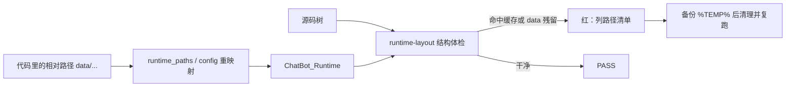

# B10.workspace-hygiene 路径重映射与树卫生

<!-- BOARD-AUTO:BEGIN -->
<!-- 本节由 scripts/board_doc_sync.py 生成，请勿手改；正文写在标记外 -->

## B10.workspace-hygiene 路径重映射与树卫生

> 运行数据根重映射、零缓存铁律与归档规程。

- 归属板块：[B10](../README.md)
- 实现落点：`scripts/runtime_paths.py`、`docs/workspace-archive-policy.md`

### 三级入口

| 三级入口 | 路由席位 | 能力 id | 别名/帮助页 | 优先级 |
|---|---|---|---|---|
| [相对路径到 Runtime 的映射](runtime-paths.md) | — | — | — | — |
| [压缩→验证→移出](archive-procedure.md) | — | — | — | — |
<!-- BOARD-AUTO:END -->

## 这个功能解决什么

这个仓库同时是「AI 工作区」和「生产源码」。如果两者的边界不立起来，会出现三种事故：AI 把几百万行的运行日志和 SQLite 读进上下文（Token 直接爆）；测试把数据库、缓存、卡片写进源码树（下次提交把用户聊天记忆 commit 进 git）；或者反过来，清理缓存时把不可再生的运行数据删了。

所以本簇管的是一条边界加一套规程：**源码区只放源码，运行数据全部外置；要移出去的东西先证明移得掉**。

三个目录的职责（口径来自 `WORKSPACE_GUIDE.md` 与 `docs/workspace-archive-policy.md`，规范条文在 `docs/boards/_conventions.md` 的留档条款）：

| 目录 | 谁写 | AI 是否扫描 |
|---|---|---|
| `ChatBot\`（本工作区） | 源码、tests、现行 docs、personas、scripts | 是 |
| `ChatBot_Runtime\` | venv、SQLite 群、cookie、日志、缓存、卡片资产 | 否，且不可删 |
| `ChatBot_Archive\<日期>\` | 历史归档包 + manifest | 否 |

## 处理流程



## 边界与降级

- **保护优先**：Runtime 下的 SQLite、FAISS、向量嵌入、聊天记忆、cookie、订阅状态、媒体缓存、日志、venv 一律不可删（除非用户明确要求）。磁盘紧张用数据库 `VACUUM`、索引重建、日志轮转、媒体缓存配额解决，那是另一件事，不是「省 AI Token」的手段。
- **`.gitignore` 不限制 AI 扫描**：能限制扫描的只有工作区根目录的选择。别指望忽略规则保护上下文。
- **不可再生 vs 可再生**：`ChatBot_Runtime\cache\`（ruff/mypy/pytest 缓存）可随意清；`data\` 与 `venv\` 不可。归档前先确认目标不是运行所需的源码、配置、活动人格、知识源、数据库或 venv。
- **零缓存铁律的例外要说全**：`plugins/bot_unified_runtime/domains/weather/assets/qx.json`（NMC 天气区县码表）是随包内置资产，`.gitignore` 已加否定规则。它被当作缓存误清过，后果是 NMC 天气路径整体塌向兜底源——这条例外写死在规范里，清理波不许动。
- **手工清库的硬前提**：先停 bot 进程。WAL 模式下残留的 `-wal`/`-shm` 未合并就删文件等于丢数据，删也要连同伴生文件一起删（`docs/db-owners.md` 顶部约定）。

## 测试与验收

`dev.ps1 -Task runtime-layout`（真身 `scripts/runtime_layout_smoke.py`）是本簇的常驻结构门：它只看形态、绝不打开数据库内容、不调 LLM、不连平台、不打印 dotenv 里的秘密。PASS 输出会逐项交代它看见了什么（源码工作区、运行根、运行数据目录、外置数据库、localstore 外置、源码生成目录为空、字节码缺失）。

日常复跑命令：

```powershell
powershell -NoProfile -ExecutionPolicy Bypass -Command "& '.\scripts\dev.ps1' -Task runtime-layout"
```

绕开 `dev.ps1` 直跑解释器时的卫生三件套：`PYTHONDONTWRITEBYTECODE=1`、`--basetemp=$TEMP/xxx`、`-p no:cacheprovider`。

## 现行缺陷

- 部分测试以默认路径把运行数据写进源码树（好感度、反思、称谓偏好等 sqlite），属 AGENTS 问题台账 #1 的测试卫生残余，根治方向是 Wave-6 逐件 `tmp_path` 化；全量套件直跑会触发，conftest 的源码树运行数据守卫会在当场失败并报出新增文件。
- 归档规程靠人执行：没有「归档前检查目标是否为活动数据」的机器门，只有清单与评审。
- `ChatBot_Archive` 下历史上出现过嵌套废弃路径（`ChatBot_Archive\ChatBot_Archive\...`），规范禁止新建，但没有自动检测。
