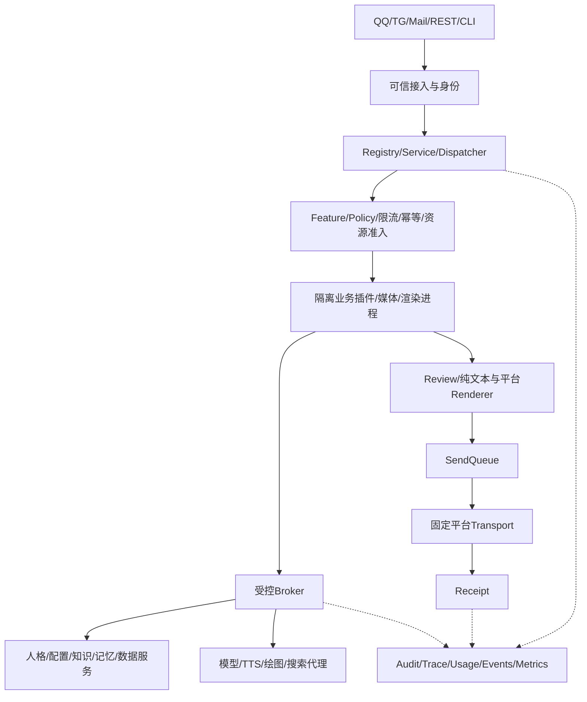

# 守岸人 Bot 后端实施规范 V2.1：架构、执行与交接
> **术语说明（2026-09-20）**：本文中的 **NapCat** 指 2026-09-18 之前的 QQ 协议端（当时实况记录，保留原文不改写）；现役协议端为 **SnowLuma**，见 [../snowluma-setup.md](../snowluma-setup.md)。

> 状态：用户批准的目标设计，尚未完整实施。本文件与 [产品扩展](backend-v2-product-extensions.md)、[验收矩阵](backend-v2-acceptance-matrix.md) 合起来构成完整实施合同。后者针对好感度、计费、日程、自愈、搜索、告警、实战验收补充并细化本文件。旧交接中的“完成”“通过”不自动成为本规范证据。

## 0. 接手顺序和已授权范围

1. 读根目录 [AGENTS](../../AGENTS.md) 与 [HANDOFF-NEXT](../../HANDOFF-NEXT.md) 顶部，再读本文件和扩展规格。
2. 读 [验收矩阵](backend-v2-acceptance-matrix.md)、根目录 `findings.md`／`progress.md`（未跟踪在飞稿，2026-09-30 下午整树清空事故中丢失，git 从未跟踪 ⇒ 不可点；证据以门禁现算为准），按任务编号直达代码，禁止从零重复全仓探索。
3. 保留工作树全部 WIP；不得 reset/clean、覆盖其他改动、擅自提交或推送。
4. 能用子代理就用子代理，时刻保持并行满载，以限流为唯一上限；撞限流墙先落盘保进度（断点续跑），子代理结束立即派遣新的子代理补位；主会话不占前台，派完即收、留对话空间（2026-09-17 用户裁定）。无依赖任务并行派遣，依赖任务按序；阶段验收后继续下一阶段，不能把局部切片当整体完成。
5. 本次交接仅修改文档，没有生产代码修改、数据库迁移、模型调用、发送、进程重启或好感度修复。用户后续要求执行时按本规范推进。

已确定：所有业务插件强隔离；自动运行恢复允许，自动代码补丁必须待审、不得自动部署；前端不制作；未来 AxonHub 模板通过后端 REST/SSE 接入，不把 AxonHub UI 当第二套业务服务。

默认生产数据位于兄弟目录 ChatBot_Runtime，保护不删改；解释器为 `../ChatBot_Runtime/venv/Scripts/python.exe`。不扫描 Runtime/Archive、不打印密钥、Cookie、Token、原始生产 Prompt。

一次授权原则：开工时汇总真实验收所需 admin 收件主体、平台测试目标、模型/金额预算、测试时间窗、是否允许新建临时数据、重启/迁移许可；从现有非敏感配置能确定的内容不再提问。未获授权的外部写入不擅自执行，继续所有不依赖它的工作；同一范围已获授权后不得逐阶段重复申请。未知新风险或范围扩张才单独升级，不允许以“一次授权”绕过新的强制权限边界。授权包见扩展 §8。

## 1. 真实基线与禁止虚报

需要复用：Feature/Config/Events/Workspace/Actions 的现有服务、RuntimePipeline、SendQueue、ledger、channel_health、视频理解、文件网关、搜索和知识检索。

首先验证以下已发现源码风险，不要继续堆占位 API：

- platform 路由内部 `_kind/_action/principal` 可能进入公开参数，路由直接操作 Store。
- PlatformStore 跨实例 CAS 不完整，Trace 建表主键与 append 列名不一致，缺生命周期收口。
- Persona draft/publish 仅改标记、重建返回不存在的 job、未装配 setter 仍返回 applied 等假成功。
- `_app.py` 局部 `_path` import、RuntimePorts/queue/config 注入缺口、用 runtime_attached 假定 SnowLuma 已连接。
- 两份 Dispatcher 未完整接管；回戳等平台副作用仍有直接 API 路径。
- 好感度拒答即辱骂、单位与 override、按会话内存限额风险，详见扩展 §2。
- Telegram catch-all 可能把鉴权/实例冲突永久写成网络故障。
- 节日表按月日复用、提醒本地时区与配置时区不统一。
- `.xls/.ppt` 不得伪装成现代 Office 格式解析成功。

记录四列：implementation / production_wiring / offline_validation / live_validation；另有 confidence=verified/high/low/unknown。verified 必须绑定本次构建摘要、命令、实际输出或操作回执。源码存在、mock 成功、目录有名字、返回200、静态检查通过均不能单独证明业务完成。

## 2. 架构与代码组织

采用单机多进程，不引入微服务集群。



| 层 | 职责 | 禁止 |
|---|---|---|
| contracts | 严格DTO、协议、错误码 | 启动副作用、加载插件 |
| control | 身份、注册、开关、参数、权限 | 执行业务插件 |
| services | 人格、知识、记忆、日程、工作区等业务 | 依赖具体前端/matcher |
| supervisor | 生命周期、隔离、资源、超时、恢复 | 决定聊天内容 |
| brokers | 模型、文件、数据库、下载受控访问 | 任意路径/SQL/API名/shell |
| plugins | 业务算法 | 生产凭据、库、系统Prompt、真实出站 |
| delivery | Review、Renderer、Queue、Transport、Receipt | 绕开门禁与幂等 |
| observability | 事实记录、查询、告警 | 从展示文本猜测统计 |
| adapters | REST、CLI、NoneBot、TG、Mail | 复制Service规则 |

可信核心包括固定装配且受审核的平台连接器和Broker，不允许外部插件在此扩展任意代码。普通 Python subprocess 不算安全边界。所有业务插件包括现有内置插件都必须迁移，不能以“内置”豁免。

先消除包 import 副作用：导入DTO/注册元数据不得注册matcher、读取生产配置、启动线程或网络。现有 `domains/core/decision/dispatcher.py` 与 RuntimePipeline 为收敛起点，合并重复控制面 dispatcher，不另建平行主链。

## 3. Windows 隔离与IPC

- AppContainer 无网络 capability；Job Objects 限CPU/内存/进程数并设置监督器退出回收。
- 独立SID/ACL、只读固定Python与插件发布包、环境白名单、IPC句柄显式继承。
- 插件无生产文件、其他workspace、凭据、控制面localhost访问；输出经AssetBroker。
- 普通插件无磁盘写权限；确需临时文件的转换器使用容量受限临时卷，不以普通目录冒充磁盘硬配额。
- 隔离键 `(plugin_id, plugin_release, isolation_scope)`，不同私有作用域不复用带状态进程。
- 无隔离环境返回 `sandbox_unavailable`，不得同权限降级。Windows验证不能代表Linux安全。

IPC：长度前缀JSON，单帧≤1MiB、深度≤32、禁pickle，二进制只传asset_id。字段：protocol_version/request_id/trace_id/plugin_id/plugin_release/operation/invocation_id/deadline_remaining_ms/input/asset_refs。

身份以连接绑定为准，不信任worker自报角色、插件ID或scope。授权保存在核心，允许条件为：用户权限 ∩ 插件批准权限 ∩ 单次invocation权限 ∩ 资源scope ∩ FeatureState ∩ 时间与配额。取消、过期或worker退出即撤销invocation。聊天插件不能把LLM建议当管理命令授权。

首个实施验收必须实测：敏感文件拒读、跨workspace拒读、禁公网/localhost、进程隔离、CPU/内存/子进程配额、句柄不泄漏、监督器退出不残留。不能skip后宣布强隔离完成。

## 4. CPU、内存、磁盘与公平调度

参数为设计初值，需基准验证；不代表当前生产设置。

| 项 | 初值/算法 |
|---|---|
| 活跃worker | 最多4，内存不足继续缩减 |
| CPU重任务并发 | min(2,max(1,logical_cpus//8)) |
| 普通/媒体/渲染内存 | 256/768/1024MiB；渲染同时最多1 |
| 插件CPU组 | 机器总算力25%，验证嵌套Job实际行为 |
| 空闲回收 | 60s |
| LLM | 全局4/provider2/同会话1 |
| TTS/绘图 | 全局2/1 |
| HTTP连接 | 全局32并叠加host限额 |
| 等待队列 | 全局128/会话4 |
| SSE | 全局100/主体5，每连接≤128事件且≤256KiB |
| 资源/事件循环采样 | 5s/1s |
| 共享缓存预算 | 64MiB，LRU+TTL+字节限额 |
| 重任务临时卷 | 512MiB |

保留内存=max(2GiB,总物理内存×8%)；新池预算=floor128MiB(min(2GiB,max(0,可用内存-保留内存)))。这只是新池准入预算，不重复将已预留内存与实际使用扣两遍；ResourceGovernor 区分 reservation、committed 和available sample。

连续3次低于保留值→停接重任务并回收空闲资源；连续3次高于保留值+512MiB才恢复。运行任务不因单次采样被杀；硬超限/安全违规可终止该隔离worker，正常禁用走drain。禁止杀与本任务无关进程。

I/O异步；解析/渲染/重查询离环；worker内NumPy/FAISS/OpenMP/ffmpeg默认1线程，防嵌套线程爆炸。调度会话轮转，交互/到期提醒/人工测试/维护权重8/4/2/1，等待30s提升一档；提权重不突破资源上限。

队列限制条数、年龄、磁盘；只清理注册可再生缓存，不删除记忆/数据库/审计。无可靠持久化时停止新的不可追溯副作用。缓存键包含owner/scope、资源/模型版本。

## 5. 统一服务、注册表、状态与投影

公开入口 `execute(context: RequestContext, request: RegisteredRequest) -> RegisteredResult`；内部纯函数不强制同签名。Context由可信接入构造，含principal/roles/scope/request/trace/invocation/entrypoint/platform/session/workspace/deadline/config_revision/persona_revision；worker只获最小投影。

调用顺序：认证→schema→scope→Feature→限流/资源→幂等→业务→输出schema→Review→结果/审计→事件。敏感读取/导出审计，普通查询不制造无意义写流量。

ProductManifest包含group/plugin/feature/sub_feature/command/help/auto_reply/scheduled_job/control_action/config/metric/trace_stage/data_resource/document/model_provider/model_channel/model。

节点必有stable_id、parent_id、kind、label、aliases、implementation_ref、capability_id、route_kind、default_enabled、reload_strategy、dependencies、required_roles、config_keys、documentation_refs、privacy_level、protected、version。

- ID唯一；alias在入口+语言+命令作用域内唯一。
- DFS验证父子环/孤儿，依赖拓扑排序O(V+E)；不可变revision快照计算有效状态。
- effective = 显式或默认值 AND 全部祖先 AND 依赖 AND scope允许。
- 父级关闭不覆盖子级显式选择；重开保留子级配置。
- FeatureState含explicit/effective/inherited_from/blocked_by/version/updated_by/updated_at/reload_status/running_tasks。
- 核心授权、审计、人格保护、错误处理、最低出站不可通过父/依赖间接关闭。
- 文档/help/metric/config按类型验证来源、schema和投影，不要求它们都有callable。
- AST发现matcher、scheduler、命令表、发送调用、参数消费；动态注册必须显式manifest。发现未登记入口阻塞发布；AST不能代替OS安全边界。

独立叶开关覆盖输入、自动触发、命令、读取、写入、模型、工具、发送、调度、主动互动、采集、重建、导出、删除、确认、help/docs展示。所有既有天气/金融/音乐/占卜/订阅/笔记/归档/校园功能一并登记，专业算法保持语义，不为统一接口重写。

核心函数：compile_registry/resolve_states/preview_change/apply_change；Config describe/validate_patch/prepare_reload/activate_revision；权限authorize/issue_invocation/validate_grant。注册一处投影到命令、help、OpenAPI、WebUI菜单、配置目录、文档；联动细则见扩展§9。

## 6. REST/SSE和错误协议

前缀 `/api/v1`，旧 `/admin/api/v1` 用适配层兼容。统一响应：

```json
{"data":{},"error":null,"meta":{"request_id":"req_...","trace_id":"trace_...","schema_version":"v1","generated_at":"UTC ISO8601"}}
```

error=code/message/request_id/trace_id/debug_id/retryable/field_errors。Pydantic严格DTO拒绝未知字段、NaN、Infinity；principal只能由认证注入。写入expected_version，创建0；有副作用POST使用Idempotency-Key，同键不同摘要409。长任务实际持久化后才202。分页默认50最大200，稳定游标。确认token绑定actor/目标/版本/摘要，120s、一次消费。

身份：独立principal和凭据记录，支持角色、scope、过期、撤销、轮换；旧共享token只做明确的兼容服务主体，不能冒充多位管理员。管理读取也按owner/scope过滤；workspace原文仅授权owner/超管。

| 资源 | 必须操作 |
|---|---|
| protocol/openapi | 实际装配、可用状态、限制、schema |
| features | list/tree/detail/children/state/preview/enable/disable/reset/audit |
| config | list/schema/detail/preview/set/reset/changes |
| logs/events | query/detail/sources/stream/export、logs/level |
| metrics | overview/messages/tokens/models/sessions/latency/errors/resources/trends |
| traces | list/detail/timeline/context/model-calls/deliveries |
| actions/jobs | catalog/detail/preview/execute/runs/progress/cancel/reconcile |
| workspaces | create/list/detail/delete/messages/preview/compare/send/reset |
| persona/profiles | list/detail/preview/draft/publish/versions/activate/rollback |
| worlds/references | list/detail/draft/preview/publish/versions/rollback |
| worldbooks | 版本能力+entries CRUD+触发预览 |
| knowledge-bases | documents/search/stats/preview/reindex |
| memories | list/search/detail/approve/reject/forget/rebuild |
| databases | catalog/schema/health/stats/queries/execute_registered |
| llm | providers/channels/models/health/routes/preview/test/config/apply/cache/reload |
| media/files/artifacts/search | 能力目录/提交/结果/受控上传/读取/生成/下载/发送/检索 |
| schedules/reminders/timetables/calendar | CRUD/解析草稿/确认/依赖/例外/下一发生时间 |
| teaching | propose/correct/approve/reject/revoke/source |
| tts/image-generation | providers/models或voices/capabilities/preview/jobs/detail/cancel |
| billing/incidents/acceptance | 详见扩展§1/§7/§8 |

静态路径先于/{id}；HTTP测试检查schema/runs/search不被吞。

SSE：REST写、SSE读；持久化单调序号，Last-Event-ID、至少一次传递与客户端去重；历史回放衔接实时；游标过期明确resync，不静默丢失。心跳15s、有界缓冲、慢客户端断开并给重同步提示。凭据放请求头，fetch流，不用URL token；权限撤销后中断订阅。无需另造重复WebSocket，未来双向实时音频再扩展。

| 错误 | HTTP/语义 | 行为 |
|---|---|---|
| unauthenticated/permission_denied/resource_not_found | 401/403/404 | 不泄漏跨scope存在性 |
| validation_error/unsupported_parameter/content_rejected | 422 | 无副作用，字段错误或人格边界说明 |
| unsupported_format | 415 | 不假解析 |
| version_conflict/idempotency_conflict/confirmation_required/confirmation_expired/feature_disabled/cancel_not_supported | 409 | 重预览/拒绝，禁止假取消 |
| rate_limited/capacity_exceeded | 429 | retry_after/稍后重试 |
| dependency_unavailable/sandbox_unavailable/provider_auth_failed/storage_unavailable | 503 | 隔离/停止相关操作 |
| provider_rate_limited | 503 | Retry-After与总预算 |
| resource_limit_exceeded/integrity_mismatch/reload_failed/rollback_failed | 503 | 回收/保留旧版本/critical冻结 |
| deadline_exceeded | 504 | 停止后续，外部在途效果对账 |
| output_contract_violation | 502 | 本地修正/模板/附件 |
| delivery_unknown | 任务/part状态 | 不滥用500，不盲重发 |

retryable仅提示，还需剩余deadline、重试预算、安全重试语义和幂等条件。错误目录为单一注册源。

## 7. 持久化、动作、热重载与一致性

操作pending→admitted→running→succeeded/failed/cancelled/unknown；cancel_requested不等于cancelled。投递queued→sending→delivered/failed/unknown/cancelled。

SQLite每库owner、有界单写执行器，CAS数据库事务；WAL、foreign_keys、busy_timeout=1000ms。网络调用不持数据库事务。业务写/版本/审计/outbox同库提交；跨库operation_id+补偿，不承诺分布式原子。

reload：prepare新资源→验证→停止新接入→drain(默认30s)→原子资源指针切换→verify消费者revision→applied→释放旧代。prepare/drain失败保留旧资源；切后失败恢复旧指针并递增版本；rollback_failed发critical，保留证据。端口/解释器依赖/进程配置诚实标restart_required，数据库路径属迁移。读取list_overrides不算完成重载。

动作登记schema/角色/超时/确认/取消/回滚/审计/后验：runtime.reload、安全重启、adapter.reconnect、napcat.status、queue.pause/resume/drain、logging.level、resources.refresh、llm.routes.reload、knowledge.reindex、memory.maintenance、diagnostics.snapshot。无真实executor必须不可用，不能返回ok。

安全重启依赖注册进程管理端口和授权；不拼任意shell，不启动重复TG poller。鉴权401/403暂停告警，409实例冲突停止争抢；网络/TLS临时错误/429/5xx退避。未知异常隔离诊断，不永久称网络错误；保留offset/取消；发送重试仅由队列掌管。

## 8. 观测、隐私与管理员可见性

日志 source 成员的唯一真身＝`domains/ops/monitor/event_store.py` 的 `EVENT_SOURCES`，本文不重列成员。category=debug/info/warning/error/success/critical/detail，与severity分开。Bot结构化、NoneBot Loguru sink、SnowLuma 批准来源跟随轮转/截断/编码；仅控制台输出时接批准launcher stdout，不另启实例。OneBot连接与日志采集状态分开。

Usage每真实attempt采集，包括failover、取消、影子；消息入站归一化计一次，出站按Receipt计，不能入队就算送达。缺数据null+unknown，不伪造0。生产/sandbox/acceptance分栏。

Trace必须串联 ingress/normalization/route/feature/policy/rate_limit/idempotency/capability/persona/knowledge/memory/router/provider/channel/model/retry/failover/review/render/queue/transport/receipt；未执行记录skipped原因。核心摘要不采样丢弃，详细上下文可采样。request/trace/span/operation/invocation/attempt/part全关联。

指标低基数，用户/会话排行走数据库聚合。原文仅授权工作区短期保存默认24h；长期脱敏摘要/统计/hash。密钥/Cookie/Bearer/绝对路径不入公共日志。审计hash链可发现篡改但不抵抗同时掌握库与密钥的管理员。跨管理员独立身份；敏感产物授权下载。

普通日志拥塞可丢弃并计数；成本调用/控制写入/投递先持久化operation与outbox，再执行。主账本不可用时不继续新的不可追溯副作用。告警与管理员验收报告详见扩展。

## 9. 人格、资料、知识、记忆、工作区

Persona/World/Worldbook/Reference：draft→validated→published→active指针；正式版本不可变；rollback创建新版本；请求开始固定persona_revision。仅超管发布人格。插件提供task_id/证据，不提供system prompt或读取核心模板。Prompt：平台约束→正式人格→任务→可信时间→带来源的不可信资料。昵称、记忆、OCR、搜索不能提权。hash损坏隔离并回到已验证版本，不能抹证据。

Worldbook条目含触发、优先级、scope、预算、引用、enabled；使用受限条件DSL，禁止任意正则造成ReDoS。Knowledge复用FTS5 BM25+向量+RRF(k=60)，候选有界，embedding阈值按模型版本；新索引验证后切换。方法search/chunk_document/reindex/swap_index。

Memory区分偏好/事实/事件/反思/提议，owner/session/source/confidence/TTL/review/version完整；propose/approve/reject/forget/rebuild。遗忘先墓碑查询排除，再清索引/缓存/活动内容；恢复备份先重放墓碑。不声称SQLite DELETE立即抹除历史磁盘字节。不同平台身份需明确绑定才能合并。

Database仅query_id+schema参数绑定，行数默认200，执行2s；列名/排序只能注册枚举，禁止任意SQL。

Workspace默认sandbox：独立历史/记忆/检索/配额/模型记录/模拟发送，不改生产好感/队列/路由健康。允许真实付费模型需计费授权和预算。选择人格/世界书/参考/KB/model参数引用真实资源，未知ID报错。compare记录版本/成本/耗时。real_session仅超管，脱敏上下文+默认预览；确认绑定内容hash/目标/版本，修改内容使旧确认失效；真实发送仍进主链。

Teaching：preference/fact/correction；用户只改自身偏好/私有记录，共享知识审核；普通教导不能改人格、权限、路由。所有提议有来源/版本/撤销/冲突策略。

## 10. Dispatcher、出站和纯文本

逐能力迁移：shadow只计算不调用模型/能力/发送；接管后旧matcher只转交，同事件同幂等键。进度ack、错误卡、订阅、摘要、提醒、校园、文件、回戳、reaction、edit/delete等全部收编。启动门拒绝未登记入口/出站绕行。

OutboundIntent含operation/target/parts/feature_id/policy_revision/dedupe_key/expires_at/trace_id。Transport固定映射平台方法，不接原始API名。发送前复验权限、feature、过期、确认和part状态；领取受控许可为线性化点，之后在途调用不能承诺撤回。pause停领取，drain等指定任务集完成，不删除队列；UNKNOWN先对账，无平台幂等时不承诺exactly-once。

ReplyDraft：schema_version=reply.v1、lines[1..12]、每行≤300字素且无换行/空白、emotion固定枚举、citation_ids/artifact_ids属本次授权集合。metadata/模型/usage由运行时写，禁止模型自报作为事实。

normalize_reply_lines→markdown-it-py AST纯文本→有界LaTeX转线性(深度16)→内部标签清理→Review/脱敏→单个换行join→平台切分再验。保留URL/文件名中的普通符号；复杂公式/代码放附件，不以正则删坏。正文非空、无空行、无Markdown/LaTeX结构，无内部标签；TG不设置Markdown parse_mode。默认不二次调用模型修格式。

四套分词分开：TokenizerRegistry用于模型预算(无真tokenizer标估算/未知)；检索FTS5 trigram+短词+向量；消息按regex的`\X`字素+标点+平台长度单位切分；TTS按语义停顿且保护小数/URL/缩写。真实计费采用provider usage。

## 11. 路由、媒体、文件、TTS与绘图

路由：授权显式指定→模态/工具/schema能力→隐私/任务约束→主题偏好→配置优先级→健康/预算。性相关允许讨论可主题优先grok-4.6，不因拒答再换模型规避边界；不关联好感扣分。正常链不改；影子预发默认关；当前分类优先、历史只补省略语境；entered_at硬TTL120min和last_activity空闲10min分开。provider/channel/model严格区分；AxonHub未提供内部channel即unknown。

熔断：60s窗至少10次且瞬时失败≥50%或连续5次→open30s；half-open仅1探测。401/403等凭据版本变化/人工测试；内容拒绝/参数错误不记网络失败；deadline耗尽不failover。

MediaAnalysisResult拆observations/OCR/transcript/subtitles/frames/entities/citations/confidence/limitations/usage/trace。GIF按帧时长覆盖；视频字幕+均匀抽帧+音轨融合，默认8帧/深度24帧；字幕按时间对齐，ASR overlap去重；图片图文联合，动漫IP给候选/证据，地点不确定明确推测，真实人物不凭脸猜身份。

FileAsset：magic/MIME/配额/owner校验；API用asset_id而非服务器路径；最终路径/句柄和reparse point检查。docx段落/标题/表格；pptx逐页/备注；xlsx公式与缓存值/禁宏；PDF文本+扫描OCR；旧Office用真实适配器；代码/Markdown/LaTeX读取不执行。网络先DownloadBroker逐跳SSRF校验。生成→静态检查→原子保存唯一asset→Review→FileGateway→Queue。用户代码执行默认不开放。

TTS接口：GET /tts/providers、/voices、/capabilities，POST /tts/preview、/jobs，GET /tts/jobs/{id}，POST .../cancel。text或approved_reply_id二选一，provider/model/voice/language/speed/format/workspace/target/version。text≤3000字符、speed1.0(0.75..1.25∩provider)、60s/20MiB；禁原始SSML/任意音色路径/URL。Review后断句合成，asset记录时长/MIME/codec/provider_operation/usage/成本/fallback。TG/QQ编码按实际能力验证，文件回退不能称原生voice。未知已受理请求不盲重合成。

绘图接口：GET /image-generation/providers、/models、/capabilities，POST /preview、/jobs，GET /jobs/{id}，POST .../cancel。task=text_to_image/image_to_image/inpaint；prompt≤4000/negative≤2000、assets/mask、provider/model、支持尺寸、count默认1最大2、seed/steps/guidance可选、workspace/version。steps≤50∩provider；输入≤20MP；未支持参数422，不静默丢弃。不接任意workflow/code/路径，不默认本地GPU。输出解码/真实MIME/尺寸/帧数/EXIF清理/Review→asset，默认预览→确认发送。TTS/绘图真实计费语义见扩展§1。

## 12. 自愈、测试与映射原则

运行自愈和代码补丁待审分开：重连、有限重试、worker恢复、缓存重建、资源回滚、UNKNOWN对账。每资源10min最多3次；full-jitter基础1s上限30s；数据库疑损不删库；不更改密钥/代理/权限/人格/审计。代码修复：脱敏故障包→隔离checkout→失败回归→最小补丁→测试/审查→待审产物，每故障最多2轮，不自动部署/提交/推送，不改测试预期或门槛掩错。

错误通过debug→operation→trace/span→plugin/release→function/build→config/persona revision→provider attempt/part→cause追溯；指纹不包含原文/密钥/绝对路径。

测试：纯函数/属性、Service临时DB与固定时钟、fake server协议、真实OS沙箱、授权实战五层。必须注入DB提交/outbox/模型在途/写文件rename/已发送丢响应/取消竞态/reload/SSE衔接故障。属性覆盖normalize幂等、无空行、不拆字素、父关子全关、幂等唯一、回滚版本递增、取消未开始无副作用、遗忘重建不复活。实战不能仅pytest，见扩展§8。

参数类型取真实Pydantic；注册表引用不重复手写；CommandDescriptor生成参数/权限/例子/help；确定性生成OpenAPI/命令目录/配置目录/README机器区/菜单/错误目录。--check只读，--write显式；生成器不得执行插件/读生产配置。统一函数指公共契约与治理，不自动猜测业务等价性。

## 13. 实施路线（并行满载）、完整性与门禁

| 阶段 | 内容与退出证据 |
|---|---|
| S0 | WIP快照、全入口/需求矩阵、故障基线，扩展问题加入同一总目标 |
| S1 | AppContainer/Job/ACL/禁网/退出/资源真实验证 |
| S2 | 无副作用装配、DTO/错误/独立主体认证；优先修假成功/注入/CAS |
| S3 | 注册/参数/文档投影/Feature，真实关闭处理器 |
| S4 | Supervisor/Broker/资源/任务状态，授权交集与取消竞态 |
| S5 | Audit/Trace/Usage/Billing/Events/Logs/Metrics/AdminIncident |
| S6 | Dispatcher/Review/纯文本/Queue，全部路径与receipt |
| S7 | 人格/世界/世界书/参考版本和防注入 |
| S8 | KB/Memory/Database/Teaching，索引与遗忘实效 |
| S9 | 模型路由/主体隔离Workspace，sandbox不污染 |
| S10 | 媒体/文件/搜索/代码资产/TTS/绘图协议与处理器 |
| S11 | 日历/课表/全场景日程链/提醒/依赖/例外 |
| S12 | 好感度重放与算法、戳/跟戳/emoji/sticker/meme/占卜/运势/塔罗 |
| S13 | 其余所有既有插件迁入沙箱并行为对照 |
| S14 | 默认真实运维动作、SnowLuma采集、NoneBot/TG恢复 |
| S15 | 全量/性能/锁依赖/安装/迁移恢复、自动实战run与管理员媒体报告 |
| S16 | 已授权窗口的生产验收；未授权部分列阻断但继续其他任务 |

每叶执行卡：feature_id/parent/目的/DTO/handler/算法复杂度/参数默认上限scope/Broker权限/资源/deadline/幂等/事务/错误回退/观测/普通边界攻击故障测试/生产装配/命令结果/外部依赖。

门禁（python固定项目venv）：

**已核实的门禁冲突，实施前必须处理：** `scripts/dev.ps1::Invoke-Test` 当前强制 `BOT_AUTOSYNC=1`，`tests/conftest.py` 因此会运行生成器`--write`，包括渲染哈希。外层设置0不能阻止脚本覆盖。这与本版“验收禁autosync、不改预期掩盖失败”要求冲突。S0先保存生成物基线，使用固定解释器直接pytest、`BOT_AUTOSYNC=0`、禁字节码、`--basetemp`指向隔离临时位置及`-p no:cacheprovider`获取不改基线的结果；实施阶段给dev脚本增加并验证尊重显式0的模式，再跑下列完整门禁。不能未经审查自动重录哈希使测试变绿；本轮没有修改该脚本或运行它。

```powershell
$py='C:\Users\LancyCelestia\Documents\MyWorkspace\ChatBot\ChatBot_Runtime\venv\Scripts\python.exe'
$env:PYTHONDONTWRITEBYTECODE='1'
$env:BOT_AUTOSYNC='0'
$env:PYTHONUTF8='1'
powershell -NoProfile -ExecutionPolicy Bypass -Command "& '.\scripts\dev.ps1' -Task test"
powershell -NoProfile -ExecutionPolicy Bypass -Command "& '.\scripts\dev.ps1' -Task lint"
powershell -NoProfile -ExecutionPolicy Bypass -Command "& '.\scripts\dev.ps1' -Task typecheck"
powershell -NoProfile -ExecutionPolicy Bypass -Command "& '.\scripts\dev.ps1' -Task runtime-layout"
& $py -B scripts/doc_sync.py --check
& $py -B scripts/command_catalog.py --check
& $py -B tests/verify_hashes.py --check
```

新增沙箱攻击/Broker权限/凭据撤销/全入口出站参数覆盖/纯文本/TTS绘图未知结果/资源浸泡/迁移恢复/锁依赖/SSE/跨年日程/全部动作/真实provider平台验收。实际e2e使用明确授权白名单和金额预算，不裸跑未知目标--execute。

基准必须记录硬件/数据规模/并发/采样窗口；不抬阈值掩盖失败。外部key/编码器/日志来源缺失记external_dependency；协议完成不等于真实可用。全部旧插件迁完前不得宣称“所有插件强隔离”。

## 14. 下一AI最短开工路径

先复核主规范§1及扩展§2的高风险源码，取得RED测试；冻结S0清单；验证S1隔离；然后按依赖串行、无依赖并行的子代理满载推进（限流为唯一上限，撞墙落盘保进度、结束即补派，主会话派完即收、不占前台）。好感问题可以先完成离线重放与修复准备，不等待沙箱采购/授权，也不能未经证据改生产分数。API/文档中已有历史测试仅作线索，不沿用为新代码通过证明。需求矩阵是完成判据，交接顶部是入口，不再堆叠互相矛盾的“最新已完成”。
