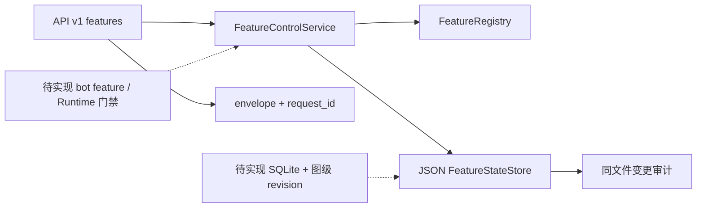

# 控制面核心切片：接口契约、审查与接手状态

> **最新串行增量：15个细分执行开关、Bot/NoneBot日志摘要采集、Telegram getUpdates网络韧性修复。详情与实跑结果见 `docs/design/COMPACT-CHECKPOINT.md` 顶部；协议见 `control-plane-registry.md`、`control-plane-events.md`。能用子代理就用子代理、并行满载（限流为唯一上限，撞墙落盘保进度、结束即补派、前台派完即收不卡输出）；未部署、完整后端未完成。**


> **历史切片：SQL功能门、配置/SSE/资源等后续实现已超出本文状态。最新只读 `COMPACT-CHECKPOINT.md` 顶部；不要按下文旧“未接线”重复实现。**

> **历史切片记录：最新实施及失败台账已转 `COMPACT-CHECKPOINT.md`。下文“尚未接SQL/Pipeline”等描述只反映上一轮，不能作为当前结论。**

> 状态：**部分实施，不可发布**。这是已批准全量后端计划的 Phase 0/1 核心修正，不代表 Phase 1 全量完成。未提交、未重启生产 Bot、未执行真实出站。下文区分实跑验证与静态审查，禁止把设计目标当作现行功能。

## 1. 下一 AI 先看这里

1. 本轮已建立 `FeatureControlService` 并将能力 HTTP 查询/写操作接到该服务，**没有接 `/bot feature` 和生产 Pipeline**。
2. 状态仍是 JSON 兼容存储，不是用户最终选定的 SQLite；仅有进程内锁。下一切片应优先做 SQLite 事务、图级 revision 与 Bot 执行门接线，而非新增一批空接口。
3. 控制面独立启动，不应假设与 Bot 共享内存。先解决实例作用域/进程通信或同进程服务注入，再承诺热生效。
4. 不改现有校园、词汇、媒体拒绝重试 WIP；不覆盖哈希基线；不删 Runtime/Archive。
5. 本轮完整回归有失败，不能发布。准确证据见 §5。

## 2. 本轮实际改动

| 模块 | 实际行为 | 验证范围 |
|---|---|---|
| `control_plane/services.py` | 无 FastAPI 依赖的 FeatureControlService；detail/list_features/tree/children/audit/change；服务层 super_admin 检查、别名解析、严格版本参数；业务异常统一映射；聚合查询使用单次锁内快照 | 单元＋HTTP 契约 |
| `control_plane/features.py` | 验证 parent/依赖缺失及混合环；禁止通过父/依赖间接关闭受保护节点；reset 版本单调保留；写盘失败回滚内存与审计；preview 不保存不审计；审计 before/after/request_id；坏文件拒绝加载；内存审计限制200条 | 单元＋恢复/失败注入 |
| `control_plane/api/protocol.py` | v1 envelope、请求 ID ContextVar、严格 FeatureChangePayload/FeaturePreviewPayload；extra 字段禁止 | HTTP 契约 |
| `control_plane/api/v1.py` | 所有 features 路由调用服务；新增 preview 和认证 OpenAPI；配置历史路由前移避免被 `{key}` 遮蔽；未接入接口明确 503；CPU 百分比无采样器时 unknown | HTTP 契约 |
| `control_plane/_app.py` | 同一 v1 read 支持只读/超管令牌；相同读写摘要禁用写；超管写入记录 actor；v1 成功/业务错误/验证错误/404/405/Host 错误/500 统一 envelope；v1 HTTP 访问进入原审计表 | 原 M1、Host、v1 回归 |
| `tests/test_control_plane_services.py` | 服务权限、请求 ID、严格输入、reset 冲突、preview、OpenAPI、相同令牌拒绝提权、占位接口不假成功 | 实跑 |
| `tests/test_feature_store_integrity.py` | 依赖图、受保护节点、事务失败恢复、版本、审计隔离、预览、损坏文件 | 实跑 |
| `tests/test_control_plane_v1.py` | 从源码目录改用 TEMP，显式注入测试审计库和渠道对象，避免写默认 Runtime 审计路径 | 实跑 |
| `docs/config-catalog-full.md` | 补录上轮遗漏的 features_file/super_admin_token_sha256 两个字段 | 文档门禁实跑 |



保护范围是已登记的核心节点及其传递父/依赖；默认注册表仍仅为 weather/chat/control_plane 等初始节点，**不是全量产品注册表**。hot_toggle 仍是元数据，不等于运行时启停已接通。

## 3. 当前可消费的协议

### 认证与响应

- 前缀 `/api/v1`，只接受 `Authorization: Bearer <token>`；不通过 URL 传递令牌。
- GET 接受只读令牌或超管令牌；写 features 需要独立超管令牌。服务层再次检查角色。
- `X-Request-ID` 由服务端生成，客户端提交的同名头不被信任。响应 meta、错误体及 feature 变更审计共用同一 ID。
- v1 响应 `Cache-Control: no-store`。legacy `/admin/api/v1` 保留旧响应格式；该兼容路径不是新前端主协议。
- 成功：`{data: ..., error: null, meta: {request_id, schema_version: "v1", generated_at}}`。
- 失败：`data: null`；error 包含 `code/message/debug_id/request_id/retryable/field_errors`。目前校验失败 field_errors 为空，避免回显请求正文；字段级安全诊断还需完善。
- 401 无有效凭据；403 无写权限/受保护能力；409 版本冲突；422 非法参数；503 服务未接入或持久化失败；500 未预期内部错误。
- 503 的 retryable 不表示可以盲目重发写操作：客户端须先刷新状态、确认版本及失败原因。

### Features

已接入：GET `/features`（kind/enabled/search）、`/features/tree`、`/features/{id}`、`/children`、`/state`、`/audit`；POST `/enable`、`/disable`、`/reset`、`/preview`。

变更 payload（version 必须是非负整数，不接受 bool/字符串/额外字段）：

```json
{"expected_version": 0}
```

预览 payload（null 表示恢复默认）：

```json
{"expected_version": 0, "enabled": false}
```

预览返回 state、affected、affected_ids，不落盘、不增加审计；affected 包含传递依赖消费者。真实变更后 version + 1，reset 不再回到 0。版本目前仍是**节点局部版本**，祖先变化不会递增子节点版本；不能用它作为完整并发快照令牌。

### OpenAPI 与客户端适配边界

- GET `/api/v1/openapi.json` 需认证，schema 放在 envelope.data 中。
- 已声明 `ControlPlaneBearer` 安全 scheme 与 v1 路由安全需求；功能写请求有严格 Pydantic schema。
- 当前多数响应仍是字典 DTO，尚非全产品强类型 SDK；不得宣传“所有前端适配器已经完成”。
- 暂无 SSE、浏览器 SDK、前端页面，也未移植/修改 AxonHub 模板。

### 不可用接口不会伪装成功

- `/config/changes` → 503 `config_history_unavailable`，不再被 `{key}` 遮蔽。
- `/logs` 未注入采集器 → 503 `logs_unavailable`。
- `/traces` → 503 `traces_unavailable`。
- GET/POST `/workspaces` → 503 `workspace_unavailable`，不会生成不存在的 workspace_id。
- `/logs/sources` 只是目标来源目录，不是采集器连接证明。
- `/metrics/resources` 仅提供现有进程可采样数据；CPU 百分比尚无持续采样，返回 null/unknown，不把首次采样的 0 当真值。
- Config preview/set/reset 仍是上轮原型实现，未进入 ConfigControlService，**没有 CAS/资源 reload/持久化失败回滚保证，不可作为正式生产热更新接口**。

## 4. 审查发现与接手次序

以下是定向源码审查，不是线上行为验收；定位使用符号，行号会随改动漂移。

| 优先级 | 位置/事实 | 下一步与验收 |
|---|---|---|
| P0 | `runtime/pipeline.py`、插件入口未消费 FeatureState | 接入主能力执行前和媒体/事件副作用前的有效状态门；测试关闭后无能力调用、无模型扣账、无出站 |
| P0 | `control_plane/__main__.py` 独立入口；`bot.py` 未见自动挂载 | 明确同进程依赖注入或受控 IPC；不得对独立进程全局对象假装热更新 |
| P0 | FeatureStateStore JSON 只用线程锁，节点 version 不含祖先状态 | 迁移 SQLite 事务＋图级 revision；迁移前只读验证/备份旧 JSON，损坏文件不得静默丢弃；跨实例 CAS 测试 |
| P0 | `runtime/settings.py::_save` 通知在落盘前且吞 OSError | 独立 ConfigControlService；失败回滚/资源 reload 回执；API 与 `/bot runtime set` 同一事务边界 |
| P1 | `runtime/capability_registry.py` 只有 Route/Interface/Help 声明 | 全量显式登记插件/子功能/触发/命令/任务/文档/配置，建立实现与注册双向覆盖门 |
| P1 | `decision/dispatcher.py::dispatch` 仍 NotImplementedError；shadow 对 engine_only 回退 legacy | 逐能力接管，不重复授权/限流/幂等/发送；禁止直接开放 engine_only |
| P1 | `capabilities/chat.py` 图片有 direct/relay 双路径 | 总开关在媒体准备前覆盖两条路径，不只关 relay |
| P1 | 入口 `_transcode_record_segments` 与 chat ASR 是两阶段 | 禁用语音识别时同时禁止预转码/供应商调用；区分视频音轨策略 |
| P1 | chat 视频新编排关闭后仍可能 `describe_video` | 独立视频总开关与编排模式开关，父开关同时阻断新旧支路 |
| P1 | `sources/vision_describe.py` 已有 GIF 多帧拼条（最多三处） | 复用而非重造；登记 GIF 子功能，默认总禁用不做隐式静态识别 |
| P1 | 入口文件段在构造 IncomingMessage 时已经调用 `sources/file_reader.py` | 文件安全门前移至读取前；不能仅在 chat 中关闭；校验允许路径、大小、IO预算 |
| P1 | 戳一戳 handler 直接 group_poke/friend_poke；BOT_POKE 热覆盖合并缺失 | 回戳/文字/Meme 同门禁并进入统一出站；补热更新消费测试再恢复热改白名单 |

全量原计划 Phase 2–8 继续有效：事件总线/SSE、结构化 usage/trace/资源采样、隔离 workspace、人格与世界书版本、知识/记忆/数据库、模型 provider/channel/model、白名单动作、多媒体/文件/代码网关。当前均**未在本轮完成**，不要用无实现的 200 占位补齐接口表。

## 5. 实跑证据与发布阻塞

- 首轮新增服务/API 契约：15 failed（缺失服务、request ID、preview、严格版本、超管读支持等），随后实施。
- 坏文件测试：6 failed，修复为拒绝加载后纳入控制面回归。
- 最新控制面＋文档同步门：**120 passed in 6.46s**。
- 最后全 plugins Mypy：**Success: no issues found in 272 source files**；此前控制面限定 Mypy：**Success: no issues found in 11 source files**（有依赖模块 annotation-unchecked 提示，不是错误）。
- 本轮控制面与新测试 Ruff：**All checks passed!**；最后仍需以收尾重跑为准。
- 全量离线快照：**3 failed, 6203 passed, 9 skipped, 3 xfailed, 1 warning in 200.29s**。此快照早于最后的坏文件/OpenAPI补充测试，不能当作最新全绿证据。
- 三个全量失败：`test_deadline_budget` 仍断言默认150，而源码默认300；`test_doc_sync_gates` 缺2个控制面键（本轮已补，复跑通过）；`test_no_source_tree_data_writes` 检测源码树 data/cards。未修改预算测试，也未删除 data/cards。
- 全树 Ruff 有2个未改的校园 WIP问题：campus.py 的 S110、test_campus_digest.py 的 C408；另有旧临时目录权限警告。
- runtime-layout 实跑失败：源码 data/ 残留与 628 个 Python 缓存路径。缓存来源未归因，不声称全为本轮或全为历史生成；未擅自清理。
- 独立复查发现列表/树混合读取新旧状态、内存审计无限增长；已用4个失败测试复现并修正，纳入最新120例。当前兼容审计仅保留最近200条（查询最多100条），长期审计仍需SQLite/归档层，不能声称满足长期保留。
- `doc_sync.py --check`、`command_catalog.py --check`（75 topics）、`verify_hashes.py --check` 实跑 exit=0；未重写生成物。
- pytest 在沙箱 TEMP 下遇 Windows PermissionError；经提权以独立 TEMP 重跑得到上述有效结果。
- 本轮未执行 dev.ps1 test 的自动 --write 链，避免无意覆盖他人的生成物/哈希；使用等效全量 pytest，BOT_AUTOSYNC=0。
- 未执行真机 `e2e_acceptance --execute`，没有重启/部署/commit/push。

最短复跑（在项目根目录，Runtime venv仅作为解释器）：

```powershell
$py = 'C:\Users\LancyCelestia\Documents\MyWorkspace\ChatBot\ChatBot_Runtime\venv\Scripts\python.exe'
$env:PYTHONDONTWRITEBYTECODE='1'
$env:BOT_AUTOSYNC='0'
$base = Join-Path $env:TEMP ('cp-verify-' + [guid]::NewGuid().ToString('N'))
& $py -B -m pytest tests/test_control_plane_services.py tests/test_control_plane_v1.py tests/test_control_plane_m1.py tests/test_control_plane_host_guard.py tests/test_feature_store_integrity.py tests/test_doc_sync_gates.py -q --basetemp=$base -p no:cacheprovider
& $py -B -m ruff check --no-cache plugins/bot_unified_runtime/control_plane tests/test_control_plane_services.py tests/test_control_plane_v1.py tests/test_feature_store_integrity.py
& $py -B -m mypy --cache-dir="$env:TEMP/cp-mypy" --explicit-package-bases --ignore-missing-imports plugins
```

文档/哈希生成物只能用项目脚本生成；不得删测试、抬性能阈值或重录无关基线掩盖失败。
