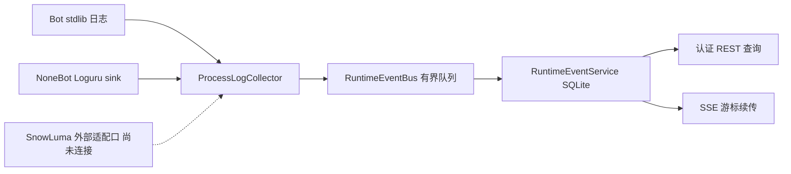

# 控制面日志与实时事件协议：当前实现边界
> **术语说明（2026-09-20）**：本文中的 **NapCat** 指 2026-09-18 之前的 QQ 协议端（当时实况记录，保留原文不改写）；现役协议端为 **SnowLuma**，见 [../snowluma-setup.md](../snowluma-setup.md)。

## 已有能力与本批增量

RuntimeEventService（SQLite）与 RuntimeEventBus（有界非阻塞入口、后台 writer）仍是唯一归档与查询入口。
本批新增 `control_plane/log_collectors.py`，将 stdlib 与已加载 NoneBot Loguru 的日志转成**结构化摘要**。
不复制用户正文、异常堆栈、Bearer、Cookie、路径或 Prompt；当前不是完整原始控制台查看器。



### 生命周期

- 仅 `runtime_attached=True` 且装配事件服务时创建采集器；standalone 控制面不能假装监听到了 Bot 日志。
- FastAPI lifespan：先 start bus，再 attach collector；关闭时先 detach 自有 handler/sink，再排空 bus。
- 不移除已有 handler，不改全局日志级别，不因 standalone 查询导入/启动 NoneBot。
- collector 仅采已知项目/NoneBot 命名空间；总线自身日志排除，避免失败递归。stderr/stdout、外部进程任意文件不采集。
- 生产仍须用户授权重启才会加载源码改动；本批未部署。

## API（继续使用统一 v1 envelope）

| 方法与路径 | 已实现行为 |
|---|---|
| GET `/api/v1/logs` | `after/limit/source/category`，limit 1..500 |
| GET `/api/v1/logs/sources` | 来源、七类类别及 collectors 状态 |
| GET `/api/v1/logs/stream` | SSE；`Last-Event-ID` 优先于 after，按 cursor 去重 |
| GET `/api/v1/logs/{event_id}` | 一条已脱敏事件 |

上述全部需要读凭据；写权限不因读取接口而扩大。游标已过保留窗口返回 `cursor_expired`，客户端必须提示缺口，不能静默从头续传。

### 当前事件 DTO

```json
{
  "cursor": 1,
  "event_id": "32位UUID十六进制",
  "created_at": "带时区的时间",
  "source": "telegram",
  "category": "warning",
  "message": "运行警告",
  "details": {"request_id": "req_example"}
}
```

这是当前已实现契约，不冒充计划中的完整 RuntimeLogEvent：`severity/privacy_level/occurred_at` 等顶层字段尚未补齐。
`message` 固定为类别摘要；details 只保留白名单标识和数值（未知键递归丢弃）。原文短期存储与清理策略尚未实施。

### 来源与类别

来源成员的唯一真身＝`domains/ops/monitor/event_store.py` 的 `EVENT_SOURCES`，本文不重列成员（旧版曾并列 `capability`/`renderer` 两枚，真身从未收录，属文档侧多列）。
类别：debug、info、warning、error、success、critical、detail。
映射：TRACE/DETAIL → detail，WARN/WARNING → warning，FATAL/CRITICAL → critical，SUCCESS → success；其余同名映射。
不解析 message 猜来源、Token 或错误类型；未识别类别不强行当 info。

`/logs/sources` 保留 items/categories/collector_status，新增 collectors：
- stdlib / nonebot：attached、not_connected 或明确 attach_failed/detach_failed；
- napcat：当前固定 not_connected，内部 ingest 接口存在不等于远程已连接；
- raw_content：false；
- publish_failures：适配层发布异常计数；总线拥塞/拒绝计数仍由总线维护。

`/api/v1/protocol` 在 live 且启动采集后报告 console_collectors=process_summaries，其他情况 not_connected。

## 尚未完成

SnowLuma 正式受控连接与采集、日志级别写入与审计、原始控制台短期受限查看、时间区间/trace/model 联查、脱敏下载、所有业务日志的 request/trace 传播。现有 max_events 有界窗口不等于用户已裁定长期/短期保留期限。

## Telegram 断线专项（用户提供的 09-16 日志）

- 附件先有 OneBot connected，再有 Telegram getUpdates 经 HTTP 代理 TLS ConnectError；并不能据此认定整个 NoneBot 启动失败。
- 只读探测：本机 8080/3001/7890 都在监听，经已配置代理访问无 Token 的 Telegram 公共首页返回 HTTP 302。只能证明探测时可达，不能保证网络不再抖动或 Bot 鉴权成功。
- 原 bot.py 外层 poll 重试覆盖不到上游内部吞掉的 getUpdates 异常。
- 现由 `scripts/telegram_resilience.py` 子类适配，在 getUpdates 请求边界对传输故障/429/5xx 退避 3→6→12→24→48→60s；启动期沿用同一重试机制，取消直接退出。
- 只对已知网络故障退避；409 多实例冲突、鉴权/配置错误不在此层吞掉。日志不含请求 URL、Token、异常正文；恢复时记录明确信息。
- 不重写上游 offset/事件解析，不修改 Runtime venv；sendMessage 等生产出站绝不在适配器层重放。
- 本批未更改 `.env`、代理、证书验证、生产进程，也未发真实消息。
- `tests/test_telegram_resilience.py` **12 passed**，包括真实已安装 Telegram Adapter + mock HTTP 的 offset/重试/409 测试；生产长时连通性为 unknown。

完整验证命令与全量结果见 `COMPACT-CHECKPOINT.md` 最新章节。
