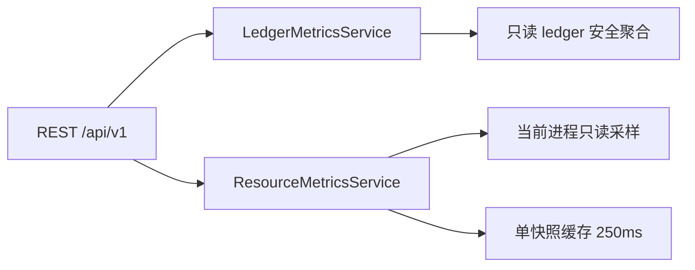

# 控制面指标协议（当前实现与未接入边界）

> 本文描述实际后端，不是完整计划的完成声明。前端仅消费 `/api/v1`，不读文件、数据库或 Python 对象。实现与验收最新状态见 `COMPACT-CHECKPOINT.md` 的续接记录。

## 服务边界



- `control_plane/metrics.py`：账本聚合，禁止任意 SQL。
- `control_plane/resources.py`：进程资源服务，工厂注入后由 overview/resources 共用；HTTP 路由不直接查询进程状态。
- `control_plane/api/protocol.py`：`ResourceMeasurement`、`ResourceSnapshot` 和统一 envelope；认证 OpenAPI 包含这些 schema。
- `control_plane/_app.py`：每个 app 装配一份 sampler，可注入测试源；不启动采样后台线程，不扫描目录，不创建统计数据库。

## 资源 API

`GET /api/v1/metrics/resources` 与 `GET /api/v1/metrics/overview` 的 `data.resources` 返回同一服务的快照。均需要管理员或超管 Bearer 认证；Host 限制与其他控制面 API 一致。

```json
{
  "data": {
    "pid": 123,
    "process_role": "bot_host",
    "captured_at": "<UTC ISO timestamp>",
    "sampling": "on_demand",
    "minimum_interval_seconds": 0.25,
    "measurements": {
      "cpu_percent": {
        "value": null,
        "status": "unknown",
        "reason": "warming_up",
        "unit": "percent_one_core"
      }
    }
  },
  "error": null,
  "meta": {"request_id": "req_...", "schema_version": "v1", "generated_at": "<UTC ISO timestamp>"}
}
```

上例仅摘录一个测量项，不代表实际响应只有该项。

| 测量项 | 单位 | 实际来源/边界 |
|---|---|---|
| cpu_time_seconds | seconds | 当前进程累计 user + system 时间 |
| cpu_percent | percent_one_core | 两次累计 CPU 时间差 / monotonic 时间差 × 100；多核可超过 100 |
| memory_bytes | bytes | 可选 psutil 的当前进程 RSS |
| thread_count | count | 可选 psutil 的当前进程 OS 线程数 |
| uptime_seconds | seconds | 当前墙钟减当前进程创建时间；不是控制面路由创建时间 |
| task_count | count | unknown / not_connected；未跨线程猜测 Bot event loop 任务数 |
| queue_depth | count | unknown / not_connected；未接入队列源 |
| llm_concurrency | count | unknown / not_connected |
| database_bytes | bytes | unknown / not_connected；不扫描 Runtime 目录 |

### 语义与兼容

- 只读当前进程。`runtime_attached=true` 时标记 `bot_host`，独立控制面标记 `control_plane_host`；不能把独立控制面资源当成另一进程的 Bot 用量。
- 第一次 CPU 采样为 `unknown/warming_up`；采集失败为 `unknown/source_unavailable`。恢复后重新预热。计数器回退为 `unknown/counter_reset`。
- 只有一个有效采样窗口证明确实空闲才返回 CPU `0.0`，不会用零代替缺失数据。
- 采集异常按字段隔离；不返回异常原文、路径、凭证或环境变量。psutil 不可用时 CPU 累计/差分仍可用，内存/线程/运行时长诚实降级。
- 250ms 内复用最新快照，锁保证并发请求不争抢或重置 CPU 基线；返回深拷贝，调用方无法污染服务缓存。缓存仅一份，不随请求增长。
- 为旧调用方保留顶层 `cpu_time_seconds`、`memory_bytes`、`cpu_percent` 和状态/原因字段。新前端应使用 `measurements`，显示 unknown 原因与单位。
- 当前按需采样，无定时采样、资源历史归档或资源 SSE。`/protocol.services.resources.history=false`，不可将其画成已采集的历史曲线。

## 已接入的账本接口

- `GET /api/v1/metrics/overview`：资源与账本总计。
- `GET /api/v1/metrics/models`：按实际模型聚合。
- `GET /api/v1/metrics/sessions`：会话 HMAC 标识排名。
- `GET /api/v1/metrics/tokens`：四类 token 的已知值/未知行数及质量。
- `GET /api/v1/metrics/trends?bucket=hour|day`：账本 UTC 趋势，不是资源趋势。

账本 `provider_id` 历史上实际写入路由注册 ID，故返回 `legacy_unverified`，不能当成已核实供应商。模型使用 `actual_model`，不能把 channel 当 model。未接入的 attempt/failover 计数保持 unknown。数据源缺失不创建库，不返回伪造的全零报表。

## 验收与后续

- `tests/test_control_plane_resources.py`：预热、差分、真实零、多核、回退、异常隔离、敏感异常不泄露、缓存副本、并发、服务共享、认证及 OpenAPI。
- `tests/test_control_plane_metrics.py`：实际 ledger schema、聚合口径、隐私、查询预算和 unknown/partial。
- 尚未接入：资源定时归档/趋势/SSE、消息与发送回执统计、结构化模型 attempt、完整 Trace、队列/数据库/LLM 并发资源源。后续需注入专用适配器，不能通过解析展示文案补数字。
