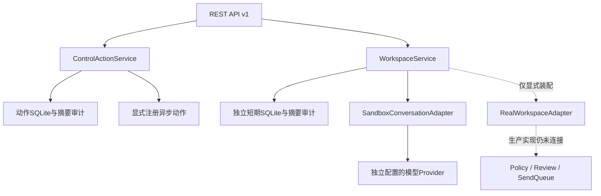

# 控制动作与隔离工作区服务

本文件记录当前实现边界，不能替代全项目发布验收。前端本阶段不开发。

## 控制动作

实现：`control_plane/actions.py`、`api/actions.py`。HTTP 只调用公开的 `catalog/detail/preview/execute/runs/run/cancel` 服务，不访问 `_registry` 或 SQLite。

- GET `/api/v1/actions`、`/actions/{action_id}`：目录、参数schema、确认要求、版本。
- POST `/actions/{action_id}/preview`：`parameters`（当前注册动作只接受空对象）、`expected_version`。
- POST `/actions/{action_id}/execute`：以上字段，加 `idempotency_key`，需要确认的动作加 `confirmation_token`。
- GET `/actions/runs?limit=50`、`/actions/runs/{run_id}`：运行记录；静态runs路由必须早于动态action_id。
- POST `/actions/runs/{run_id}/cancel`：只接受 `expected_version`，不能悄悄忽略其他参数。

服务负责超管权限、CAS、五分钟单次确认、actor绑定、幂等、超时、协作取消、状态和脱敏审计。错误由app统一转换，保留404/409/422/429/503，不把所有异常误写为422。

16个运行/结果未知动作的容量约束在SQLite事务内校验；不同实例不能绕过。相同幂等键不能执行另一动作。结果未知时不自动重放。

**未完成**：默认生产动作注册及安全重启/重连/队列控制等具体适配器；仅注入服务时动作接口可用。空schema不是已实现所有动作参数的宣称。未装配返回503，协议清单如实说明。

## 工作区

细节见 `control-plane-workspaces.md`。工作区本身可持久化并走HTTP全流程；默认配置装配独立数据库和隔离生成器。真实会话只定义可注入端口，没有连接生产SendQueue。

## 依赖方向

## 本轮回归文件

- `test_control_plane_actions_api.py`：路由顺序、状态码、版本目录、RBAC、严格schema、幂等。
- `test_control_plane_actions.py`：服务确认、超时、持久化、跨实例容量。
- `test_control_plane_workspaces.py`：隔离、拥有者、CAS、过期、幂等冲突、忙状态、发送unknown。
- `test_control_plane_workspaces_api.py`：HTTP全流程及OpenAPI、权限。
- `test_control_plane_sandbox.py`：人格/资料边界、受控选型、Token记录、预算、禁止工具调用。

最新实跑结果以 `COMPACT-CHECKPOINT.md` 顶部为准。全量绿灯不代表缺失模块已实现，更不代表生产已部署。
