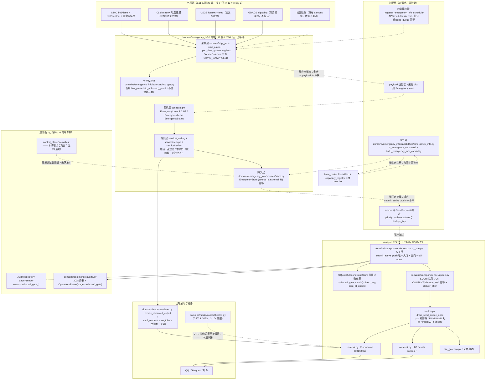
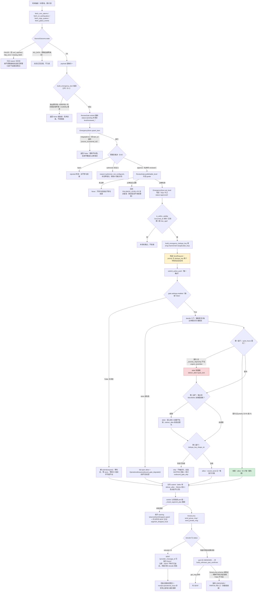
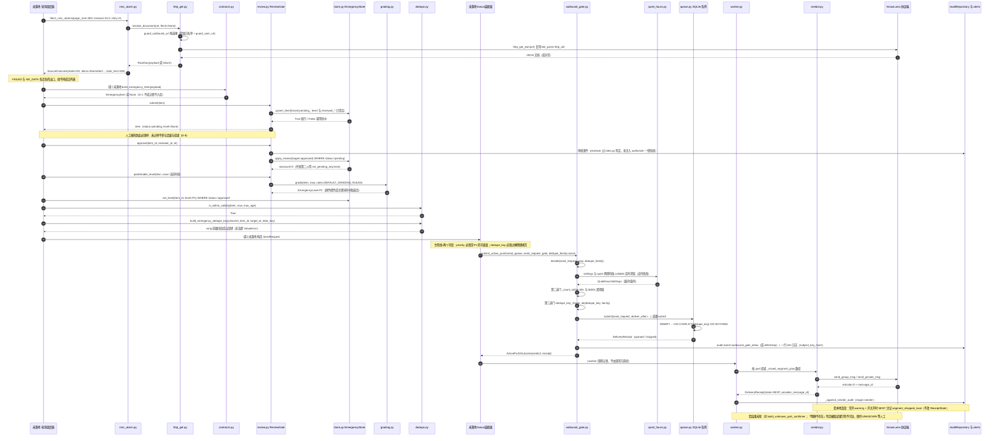

# 紧急信息聚合域 —— 统一规格（B11，2026-09-20）

> 席面：B11（紧急信息统一波 B 波，规格席）。性质=**只读现状 + 成文形状**。
> 本文不写代码、不改代码，只做一件事：把本波已落地的**中央闸**与**紧急域内核**的形状画出来，
> 使用户 mandate 的九项（架构 / 处理流程 / 流程图 / 架构图 / 模块 / 样板 / 函数 / 参数 / 变量 /
> Help 命令及帮助页）第一次有可验收的成文物。
> **取证时点**：本席 Read/grep/wc/pytest 直读磁盘于 **02:29—02:56**；开工时 HEAD=`6ffdef3`（02:24:49），
> 收席时 HEAD=`0ee9115`——**工作树在这 27 分钟内被并行会话推进过**（本文所引行号可能已漂，
> 全部结论以「文件 + 函数名/常量名」为稳定定位符；两处受影响的实数已在文中双时点标注）。
> **行号会漂**：一律以「文件 + 函数名/常量名」为稳定定位符，行号仅供参考。
> 关联件（不重复其内容，只引用）：
> `docs/design/emergency-info-outbound-gate-spec-20260920.md`（闸的规格与 §8 Amendment，闸**为什么**这样设计）、
> `docs/design/emergency-info-unify-summary-20260919.md`（A/B 波过程与五项裁决执行记录）、
> `.superpowers/sdd/2026-09-19-emergency-info-unify/reports/{B1R3,B4a,B4b,E3,E5,E11}-report.md`（逐席终账）。

---

## 0. 一句话范围 + 现状定性

**范围**：外部紧急信息（气象预警 / 政务应急 / 地震速报 / 校园紧急通知）的
**采集 → 归一 → 去重 → 定级 → 人工审核门 → 中央出站闸 → 多通道投递 → 送达核验**全链，
加一个用户侧查询/待审命令面与帮助页。

**现状三态必须分清（本域=第一态强、第二三态全空）**：

| 态 | 判定 | 实跑证据（本席取证） |
|---|---|---|
| **① 已落码** | 域内核 + 采集器 + 中央闸 + 送达核验 Tier1/Tier2 骨架，四件都在树上且**离线测试全绿** | `domains/emergency_info/` 实数 **12 件 .py / 2656 行**；本域四件测试合跑 **194 passed（02:36）→ 195 passed（02:55，`tests/test_emergency_info_sources.py` 由 B2 席在飞增 1 例）**，两次均 0 失败；`ruff check domains/emergency_info` → `All checks passed!` |
| **② 未注册 / 未接线** | 没有 RouteKind、没有能力层、没有装配门、没有调度器、没有帮助页、没有配置键 | `grep "bot_emergency" config.py` → **0 命中**；`grep -i emergency` 在 `base_router.py` / `capability_registry.py` / `echo.py` / 根 `__init__.py` → **全部 0 命中**；`domains/emergency_info/` 无 `capabilities/` 目录 |
| **③ 未生效** | bot 进程未重启，且生产根本没有指向本域的代码路径；闸在紧急域通起来之前对现役行为零影响 | `grep -rn "submit_active_push\|outbound_gate\|send_queue" domains/emergency_info/` → **0 命中**（闸**零消费者**）；全仓 `build_emergency_capability` / `is_emergency_command` / `build_emergency_send_request` / `fanout_emergency_push` / `to_payload` / `EmergencyTarget` → **各 0 命中** |

**一句话**：**内核是绿的，接缝是断的。** 本域今天是「一个可离线复跑的数据与规则库 + 一个已就位、无消费者的中央件」，
**不是**一个生产在跑的能力。**任何把本文当作「功能已上线」来读的用法都是错的**；
上线还差 §8.1 的三条缝（采集器↔内核、内核↔闸、命令面注册九同步面）+ 配置键落地 + 提权重启。

三条不可软化的裁定基线（原文在 `briefs/b-wave-addendum.md` §1）：
**D-1 无源诚实不接**（缺字段即 None/抛错，绝不填假值）、**D-2 仅 P0/P1 穿安静时间**、
**D-8 入库即 pending、过审才参与定级与投递**。本域代码逐条有实现点，见 §4/§6。

---

## 1. 架构图（域内外边界 · 中央件 · 队列 · 渲染 · TTS · 控制面）

实线=代码已在树；**虚线=本文设计但代码不存在**（未落地，属计划）。
域内三层（`contracts` 纯数据 → `service` 纯规则 → `sources/store` 持久）与域外中央件（闸/队列/transport/render/TTS）
的边界，就是「谁能 import 谁」的边界：内核零 `config`/零 `nonebot`/零 `httpx`/零 `llm`（三条 AST 锁已钉死，见 §4 §F），
闸零业务域依赖（只 import `policy.quiet_hours` + `core.contracts`，实读 `outbound_gate.py:45-57`）。



**读这张图的四条硬事实**：

1. **域内三条实线闭环、三条虚线断口**：断口就是本波未完成的三件事（§8.1 缝①②③）。
   图上没有装饰性虚线——每一条虚线都对应一次「grep 0 命中」的实跑。
2. **闸在 transport、不在本域**：`submit_active_push` 是**主动投递触达队列的唯一入口**（`docs/design/emergency-info-outbound-gate-spec-20260920.md` §1.2 三选否），
   本域不得 import `send_queue.submit` 绕闸，也不得建第二套去重账（幂等唯一执行点=`queue.py:444-476` 的 `ON CONFLICT`）。
3. **渲染与 TTS 不在本域**：卡片色只能走 `theme_tokens`（D-3；本域只出 `LEVEL_COLOR_LABEL` 文案色名，实读 `contracts.py:84`）；
   紧急卡模板**不存在**（`card_render/templates/` 实数 7 件：affinity/error/finance/market/mermaid/song_candidates/universal，无 emergency）。
   TTS 按 D-7「先修谎报再接播报」，本波不接（谎报根修一半已在 `onebot.py` Tier1 落地，见 §2 末段）。
4. **观测面本域专属为零**：闸的审计/告警已就位（`outbound_gate.py:442 audit`、`:406 note_issue`），
   但 `control_plane/` 与 `webui/` 全域 grep `emergency` = **0 命中**——紧急域没有看板与端点，属计划。

---

## 2. 处理流程图（全链 + 失败分支 + 降级出口 + 漏报分叉）

主链八段：**采集 → 归一 → 去重 → 定级 → 审核门 → 闸 → 投递 → 回执核验**。
每段右侧标出「失败/降级出口」——本域的设计取向是 **fail-closed 在数据面（不成立就不入库）、
fail-open 在投递面（闸生病绝不变成丢消息）**，两个方向都各有测试锁。



**图中必须被读到的一条方向性风险（P0 静默顺延 = 漏报）**

`M` 节点（构造 `SendRequest`）是全链唯一能让 P0 预警「按时到」或「被压到天亮」的地方：

- 闸的严重度载体**已经钉死**为 `SendRequest.priority`——实读 `outbound_gate.py:248 _severity_of()`
  返回 `str(send_request.priority or "").strip().upper()`，`:252 _is_urgent()` 拿它比对
  `urgent_severities`（配置 `bot_outbound_gate_urgent_severities`，缺省 `["P0","P1"]`，`config.py:236`）。
- 因此：**若装配面忘了 `priority=str(item.level.value)`（例如沿用现役推送族的 `priority="normal"` 字面量），
  那么 `decide()` 的第一道门就认为这条不紧急，00:00–06:00 窗内一律 `defer` 到 06:00**——
  系统全绿、审计正常、**用户没在半夜收到红色地震预警**。这是**漏报**，不是误报，且**静默**（无告警、无异常）。
- 上图中 `Q1`（被顺延）与 `Q2`（穿窗）就是这一枚硬币的两面；两者的差别**只在 M 那一行的一个字段**。
- 处置建议（本席不实现）：注册波必须加一条用例锁「P0 出网时 `SendRequest.priority == "P0"`」，
  并把该断言放在**离闸最近**的位置（构造 `SendRequest` 的函数上，不是路由表上）。
  口径更正见 §8.4：本波简报把它写成「落 `RouteRule`」，坐标与载体都不对——`RouteRule.priority` 是**路由匹配序**，
  与静默顺延无关；真正的载体是 `SendRequest.priority`（构造投递请求时）。

---

## 3. 时序图（一次 P1 红色地震/暴雨预警：从轮询到 SENT + 审计注记）

调用序按**真实函数名**标注；`未落地·` 前缀=本席 grep 0 命中的计划件（不装作在跑）。
本图主取「过审后自动投递」这一支（源侧官方预警走审核门的路径见 §8.1 的裁量：
D-8 的原文对象是「人工报料」，官方源是否也要过 pending 属**待用户裁**，见 §8.3-补）。



**三点时序事实（可反驳，且都被现有测试锁着）**：

1. **审核门在定级之前**，且结构性不可绕：`ReviewGate.submit` 会把自带的 `approved`+`P0`+`reviewed_by` 一并钉回
   pending 并清空（`domains/emergency_info/service/review.py:81-96`），`publishable_level()` 对未过审返回 `None`（`:192-205`），
   存储侧 `set_level` 的 SQL 还带 `WHERE status='approved'`（`domains/emergency_info/sources/store.py:177-185`）——**三道同向守卫**。
   锁：`tests/test_emergency_info_core.py::test_submit_forces_pending_and_strips_level_and_review_marks` 等（§4 §D）。
2. **闸不改状态机**：`submit_active_push` 只在 allow 时 `record_send`，defer 用队列原生 `deliver_after`
   （`queue.py:418-438` 的「worker 最早投递时刻 + 声明无内联首投」语义），skip **不触队列**、只出自造 SKIPPED 回执
   （`outbound_gate.py:285 _skipped_receipt`）。`ReceiptState` 枚举成员集**零改动**并有冻结锁
   （`tests/test_delivery_verification_tier1.py` 枚举冻结锁用例；闸规格 §8 Amendment A-4 统一钉死「一律不改 ReceiptState」）。
3. **SENT 不是送达**：`retcode==0` 即 SENT（`onebot.py` 判定，E5 §1.7 实证），本时序图最后三个 Note 就是
   「谎报送达」的现有防线边界——**bot 本地丢段已可观测；上游协议端摘段仍未证**（SnowLuma `get_msg` schema 未取证，
   `_ONEBOT_GET_MSG_NOT_FOUND_PROVEN=False` 锁死「明确不存在→False」分支生产不可达，`onebot.py:1187`）。
   所以紧急播报（D-7）在真机取证前**不得**接语音。

---

## 4. 模块表（文件 × 公开符号 × 职责 × 抄的哪个既有正例 + 坐标）

路径均相对 `plugins/bot_unified_runtime/`。行号=本席 02:3x 直读磁盘实数（`wc -l` 见 report §复跑证据）。
「正例」列的坐标**本席逐条复核过存在性**（不转述上游未证坐标）。

### 4.1 域内已落码（`domains/emergency_info/`，12 件 / 2656 行）

| 文件（行数） | 公开符号（定义行） | 一句话职责 | 抄的既有正例 + 坐标 | 态 |
|---|---|---|---|---|
| `__init__.py`（9） | 域 docstring | 域定位 + 「不新增配置键、不注册路由、不出卡、不接语音、不碰 LLM」自述 | 一行式域 docstring：`domains/weather/__init__.py`、`domains/weather/data/__init__.py` | 已落码 |
| `contracts.py`（272） | `EmergencyLevel`:49、`_LEVEL_RANK`:73、`LEVEL_COLOR_LABEL`:84、`_COLOR_LABEL_LEVEL`:91、`URGENT_LEVELS`:96、`_LEVEL_RISK_LEVEL`:100、`is_urgent_level`:108、`level_from_color_label`:113、`to_risk_level`:118、`highest_level`:123、`EmergencyStatus`:134、`_ALLOWED_TRANSITIONS`:144、`can_transition`:153、`as_utc`:161、`EmergencyItem`:173、`build_emergency_item`:244 | 单一等级枚举 + 唯一颜色文案口 + 审核三态状态机 + 条目模型 + D-1 安全构造口 | `StrictBaseModel`＝`domains/core/contracts/runtime.py:32-33`；非空校验＝同文件 `:53-59`；区间校验＝`:264-269`；`RiskLevel`＝`:36-40`；**颜色词与序位收编**＝`domains/weather/capabilities/weather.py:112`（本席实读原文 `{"蓝色":1,"黄色":2,"橙色":3,"红色":4}`）；三态 + CHECK＝`domains/chat_reply/character/quirks.py:39-41/:157-176` | 已落码 |
| `domains/emergency_info/service/grading.py`（175） | `FALLBACK_LEVEL`:38、`GradingRule`:42、`DEFAULT_GRADING_RULES`:51、`matched_levels`:117、`color_levels_in_text`:131、`grade`:143 | D-6 纯规则定级（无网络/无 LLM/时钟注入）：源色 + 正文色词 + 关键词取最高，全不中落 P3，过期压 P3 | 白名单式判定不猜值＝`domains/schedule/service/schedule_dag.py:236-247`；「按颜色取最高」判定序＝`domains/weather/capabilities/weather.py:239` | 已落码 |
| `domains/emergency_info/service/dedupe.py`（125） | `EMERGENCY_DEDUPE_PREFIX`:27、`_SEGMENT_RE`:30、`_DATE_KEY_RE`:31、`date_key_of`:34、`build_emergency_dedupe_key`:39、`is_emergency_dedupe_key`:70、`is_within_validity`:94 | 键规范唯一出处 + 键形核验口 + 时效窗/日历日键（纯函数） | 键规范原文＝闸规格 §1.3-3；签名口径＝`reports/E5-report.md` §4.3；按日键＝根 `__init__.py:3010/:3177`（`now().astimezone().date().isoformat()`）+ dedupe 先例 `:3205/:3351` | 已落码 |
| `domains/emergency_info/service/review.py`（212） | `ReviewStore`:38（Protocol）、`ReviewOutcome`:60、`ReviewGate`:70、`submit`:81、`approve`:100、`reject`:111、`_decide`:128、`_failure`:172、`publishable`:187、`publishable_level`:192、`pending_items`:207 | D-8 审核门：入库强制 pending、过审前不参与定级与投递、未注入 authorizer 整体关闭 | propose→approve 形态＝`domains/chat_reply/character/quirks.py:202-290`（propose 只进 pending）、`:292-300`（`WHERE status='pending_review'` 守卫）；最小 Protocol 依赖＝`domains/transport/sender/queue.py:167-176` | 已落码 |
| `domains/emergency_info/sources/store.py`（243） | `DEFAULT_DB_PATH`:38、`_SCHEMA`:40、`_SELECT_COLUMNS`:69、`_format_utc`:76、`_row_to_item`:84、`EmergencyStore`:97（`upsert_item`:113、`apply_review`:155、`set_level`:177、`get`:189、`list_by_status`:197、`prune`:215）、`build_emergency_store`:226 | 唯一持久层：`(source_id, external_id)` 幂等、只从 pending 转正、按状态读回、90 天裁剪、缺省路径走 runtime_paths 重映射 | 每操作独立连接轻量库＝`domains/assistant/campus/campus_store.py:30`；幂等主键/索引与 prune＝`:17/:23-26/:101-109`；`build_*` 缺省路径重映射＝`domains/chat_reply/character/persona_service.py:739`；铁律 6 先例键 `bot_campus_db_path` | 已落码 |
| `domains/emergency_info/sources/http_get.py`（312） | `DEFAULT_TIMEOUT_SECONDS`:67、`NMC_ALARM_TIMEOUT_SECONDS`:68、`DEFAULT_RETRY_ATTEMPTS`:72、`RETRY_BACKOFF_SECONDS`:73、`_backoff_sleep`:76、`FetchState`:83、`SourceOutcome`:92、`ALLOWED_HOSTS`:148、`_SAFE_ID_RE`:161、`UnsafeIdentifier`:164、`SsrfRejectedError`:168、`require_safe_id`:172、`check_whitelisted_url`:180、`guard_outbound_url`:189、`RawDoc`:207、`fetch_json_document`:219、`resolve_document`:252、`failed_outcome`:288 | 采集族共享取数件：常量白名单 + 既有 SSRF 护栏两道闸、只重试瞬时故障、**三态显式**（`OK/NO_DATA/FAILED`），治「取数失败说成无预警」 | HTTP 客户端复用＝`domains/link_parse/parsers/http_util.py:255`（`http_get_json`，本席实读在位）；护栏复用＝`domains/link_parse/parsers/ssrf_guard.py:159`（`guard_user_url`）；退避判据＝`domains/finance/data/stock_data.py:90`（`_network_retry`）；次数/基数对齐 `domains/weather/capabilities/weather.py:82-83`（本席实读 `_NMC_RETRY_ATTEMPTS=2`、`_NMC_RETRY_BACKOFF_SECONDS=0.5`）；超时命名＝`domains/weather/data/nmc_weather.py:113` | 已落码 |
| `domains/emergency_info/sources/nmc_alarm.py`（458） | `SOURCE_ID="nmc"`:56、`ALARM_COLOR_RANK`:66、`AlarmAlert`:84、`StationAlarm`:104、`split_alarm_title`:126、`parse_beijing_time`:151、`absolutize_nmc_url`:164、`build_nmc_alarm_detail_url`:176、`build_nmc_find_alarm_url`:186、`build_nmc_rest_weather_url`:193、`parse_nmc_alarm_page`:235、`parse_nmc_station_alarm`:336、`fetch_nmc_alarms`:395、`fetch_nmc_station_alarm`:420 | NMC 全国在报清单 + 站点级当前预警（`data.real.warn`，现役天气码未消费的白捡位） | 查询/预警族取形＝`domains/weather/capabilities/weather.py`（`parse_alert_title:176-199` 同族颜色词解析；本席不 import 它，见接缝 §8.1） | 已落码 |
| `domains/emergency_info/sources/open_data_quakes.py`（591） | `ICL_SOURCE_ID="icl"`:52、`USGS_SOURCE_ID="usgs"`:53、`QuakeEvent`:72、`QuakeMatch`:106、`epoch_ms_to_utc`:158、`haversine_km`:171、`build_icl_earlywarnings_url`:188、`parse_icl_earlywarnings`:230、`fetch_icl_earthquakes`:280、`build_usgs_feed_url`:299、`build_usgs_fdsnws_url`:315、`parse_usgs_geojson`:384、`fetch_usgs_quakes`:461、`fetch_usgs_recent_feed`:489、`crosscheck_quakes`:511 | 地震双源（ICL 主 + USGS 核验）与事件匹配（±30min 且震中距 ≤200km） | 交叉核验脚注范式＝股指腾讯源 6 指数核验（AGENTS 第四部分 market 行；E11 §3 口径） | 已落码 |
| `domains/emergency_info/sources/gdacs.py`（248） | `SOURCE_ID="gdacs"`:43、`SOURCE_LABEL`:44、`GdacsEvent`:67、`parse_gdacs_events`:126、`fetch_gdacs_events`:219 | 国际灾害背景聚合（**不推送**，E11 §2 矩阵判定） | 同上（`fetch_*` 三态返回同族） | 已落码 |
| `domains/emergency_info/service/__init__.py`（5）、`domains/emergency_info/sources/__init__.py`（6） | 包 docstring | 包标记（不建则不可 import） | 仓内每层目录均有 `__init__.py` | 已落码 |

### 4.2 域外中央件（本域依赖，非本域所有）

| 文件（行数） | 公开符号（定义行） | 职责 | 抄的正例 + 坐标 | 态 |
|---|---|---|---|---|
| `domains/transport/sender/outbound_gate.py`（**774**） | `REASON_*`:75-83（九枚）、`KIND_DEGRADED`:85、`KIND_STORM`:86、`GATE_STAGE`:87、`DEDUPE_NAMESPACE="emg"`:90、`DEDUPE_FAMILY_{ONCE,DAILY}`:92-93、`STORM_CONSECUTIVE_DEFERS=3`:95、`DEFAULT_URGENT_SEVERITIES`:103、`OutboundGateSettings`:106、`OutboundGateVerdict`:121、`ActivePushOutcome`:130、`SendStore`:141、`SQLiteOutboundSendStore`:162、`dedupe_key_shape_ok`:259、`OutboundGate`:296（`decide`:480、`_quiet_verdict`:554、`audit`:442、`note_issue`:406、`note_verdict`:418、`record_send`:390、`window_count`:381）、`submit_active_push`:639、`_submit`:611、`build_outbound_gate_settings`:722、`build_outbound_gate`:748 | 主动投递触达队列的**唯一中央入口** + 三门 + fail-open + 审计/告警 | 静默窗唯一事实源＝`domains/chat_reply/policy/quiet_hours.py`（`:23` settings、`:184-195` `_parse_hhmm`；闸不写任何时刻解析，T13 锁）；确定性计数＝`domains/schedule/service/schedule_store.py:58-65`；顺延原语＝`queue.py:418-438` `deliver_after`；审计口族＝`queue.py:1813-1833 _append_sender_audit` | 已落码、**零消费者**（T6 结构锁 + 本席 grep 0 命中） |
| `domains/transport/sender/onebot.py` | `set_outbound_verify_provider`:59、`_mixed_segment_plan`:289、`_mixed_segments`:318、`_ONEBOT_GET_MSG_NOT_FOUND_PROVEN=False`:1187、`build_unknown_part_confirmer`:1222 | 送达核验 Tier1（本地丢段可观测 + SENT 注记）+ Tier2（`get_msg` 确认器骨架，「明确不存在」判定被取证锁钉死不可达） | 鸭子探测降级原语＝`onebot.py:1015 _call_optional_onebot_api`（E7 实证）；provider 注入风格＝`domains/transport/sender/timeout.py`（`set_transport_timeout_provider` 同款） | 已落码（Tier1 观测常开；Tier2 语义等真机） |
| `domains/transport/sender/queue.py`（1858） | `SendQueue`:167、`InMemorySendQueue.submit`:191、`SQLiteSendRequestQueue.submit`:418、`ON CONFLICT(dedupe_key)`:459、`_append_sender_audit`:1813 | 幂等唯一执行点 + 租约/退避/PARTIAL 断点续发 | 无需抄（现役中央件） | 已落码 |
| `domains/transport/sender/worker.py` | `unknown_part_confirmer` 形参 `:217/:737`、调用点 `:782-784` | UNKNOWN 分片对账 | 判定协议既有三分支（True→SENT/False→PENDING/None→保持） | 已落码；根 `__init__.py:1653-1668` 已接**门控**接线（缺省 None=现状） |

### 4.3 计划件（**未落地，属计划**：本席 grep 全仓 0 命中）

| 缺件 | 应有形态 | 抄的正例（坐标已复核） |
|---|---|---|
| `domains/emergency_info/capabilities/emergency_info.py` | `is_emergency_command(text) -> bool` + `build_emergency_info_capability(config, *, render_backend=None)` | 工厂签名 31/31 全中：`domains/finance/capabilities/stocks.py:422`；谓词命名法＝E3 命名表 |
| payload 适配器（采集→内核） | 采集器自带 `to_payload() -> dict`，装配面调 `build_emergency_item` | campus 装配快照形态＝`domains/assistant/campus/campus.py:54`（`build_campus_source`） |
| `build_emergency_send_request` / `fanout_emergency_push` | 单目标构造 + 多目标循环，`priority=str(level.value)` | `domains/ops/monitor/alerts.py:269-303`（`build_admin_alert_send_request` + `AdminTarget`）+ 根 `__init__.py:3333-3358`（daily_assist 扩通道维度） |
| 轮询调度器 | `_register_emergency_info_scheduler`，interval + `max_instances=1, coalesce=True` | `__init__.py` 调度器族 12 个同型（订阅 outbox 15s / send_queue 30s interval 版） |
| 出卡 | `emergency_card` 复用 `universal_card.html` 的 sections/rows，零新模板优先 | 商品/债券/北向三卡先例「零模板改动」（HANDBOOK §24.2）；色值唯一来源 `domains/render/card_render/theme_tokens.py`（`:424 ERROR_ACCENT` 是「独立主题族」的先例形态） |
| 语音 | D-7：谎报修完再接；受 GPT-SoVITS 3–10s 硬限，超长只发文本+卡 | `domains/media/capabilities/tts.py:825 build_tts_capability` |

---

## 5. 函数与参数规范（签名逐条：名称 / 参数名 / 仅关键字参 / 返回类型 / 缺省）

规范口径（全仓既有纪律，E3 命名表 + 本域实读）：**时间一律仅关键字注入**（`*, now`）；
**装配口一律 `build_*`**；**谓词一律 `is_*`**；返回类型显式；缺省值一律=「功能关闭 / 现状字节级不动」。

### 5.1 域内核（已落码，签名逐字抄自磁盘）

```python
# contracts.py:244 —— D-1 唯一安全构造口
def build_emergency_item(payload: Mapping[str, Any]) -> EmergencyItem | None
#   位置参：payload（唯一）。无关键字参。返回 EmergencyItem 或 None。
#   语义：不是 Mapping ⇒ None；pydantic ValidationError ⇒ None。
#   调用方拿到 None 必须「不入库、不投递」，禁止退化成填假 id/假时间。

# contracts.py 判定族（全为纯函数，无 IO）
def is_urgent_level(level: EmergencyLevel) -> bool                       # :108  仅 P0/P1（D-2 唯一事实源）
def level_from_color_label(color_label: str) -> EmergencyLevel | None    # :113  未知色 ⇒ None（不上抬）
def to_risk_level(level: EmergencyLevel) -> RiskLevel                    # :118  跨面唯一映射点
def highest_level(levels: Iterable[EmergencyLevel]) -> EmergencyLevel    # :123  空集合抛 ValueError
def can_transition(current: EmergencyStatus, target: EmergencyStatus) -> bool   # :153
def as_utc(moment: datetime) -> datetime                                 # :161  naive 一律按 UTC 归一

# domains/emergency_info/service/grading.py:143 —— D-6 纯规则定级
def grade(
    item: EmergencyItem,
    *,
    now: datetime,                                   # 必填、仅关键字（模块内零 datetime.now()）
    rules: Sequence[GradingRule] = DEFAULT_GRADING_RULES,
) -> EmergencyLevel                                  # 永不返回 None：判不出即 FALLBACK_LEVEL(P3)
#   辅助：matched_levels(text, rules=DEFAULT_GRADING_RULES) -> list[EmergencyLevel]      :117
#         color_levels_in_text(text) -> list[EmergencyLevel]                             :131

# domains/emergency_info/service/dedupe.py —— 键规范唯一出处
def build_emergency_dedupe_key(
    channel: str, item_id: str, target_id: str,      # 三个位置参
    date_key: str | None = None,                     # 位置可选参（非仅关键字）；按日族必给
) -> str
#   键形：emg:{channel}:{item_id}:{target_id}[:{date_key}]，段数 4 或 5。
#   段字符集 ^[A-Za-z0-9_.\-]{1,120}$（显式排除冒号与空白 ⇒ 键注入与段数歧义不可达）。
#   非法 ⇒ ValueError（空段/含冒号/含空格/日期形态错）。
def is_emergency_dedupe_key(key: str, *, require_date_key: bool = False) -> bool     # :70  闸侧核验口
def is_within_validity(item, *, now: datetime, max_age: timedelta | None = None) -> bool   # :94
def date_key_of(moment: datetime) -> str             # :34  本地日历日 YYYY-MM-DD

# domains/emergency_info/service/review.py —— D-8 审核门
class ReviewGate:
    def __init__(self, store: ReviewStore, *, authorizer: Callable[[str], bool] | None = None)   # :73
    def submit(self, item: EmergencyItem) -> EmergencyItem                       # :81   钉 pending + 清 level
    def approve(self, item_id: str, *, reviewer_id: str, at: datetime) -> ReviewOutcome      # :100
    def reject(self, item_id: str, *, reviewer_id: str, at: datetime, reason: str = "") -> ReviewOutcome  # :111
    @staticmethod def publishable(item) -> bool                                   # :187  只认 approved
    @staticmethod def publishable_level(item, *, now, rules=DEFAULT_GRADING_RULES) -> EmergencyLevel | None  # :192
    def pending_items(self, *, limit: int = 50) -> list[EmergencyItem]            # :207

# domains/emergency_info/sources/store.py —— 唯一持久层
class EmergencyStore:
    def __init__(self, db_path: str | Path) -> None                              # :100（建表幂等）
    def upsert_item(self, item: EmergencyItem) -> bool                           # :113 True=新行；False=幂等命中
    def apply_review(self, item_id, *, target: EmergencyStatus, reviewer_id: str, at: datetime) -> bool  # :155
    def set_level(self, item_id: str, *, level: EmergencyLevel) -> bool          # :177 只写 approved
    def get(self, item_id: str) -> EmergencyItem | None                          # :189
    def list_by_status(self, status: EmergencyStatus, *, limit: int = 50) -> list[EmergencyItem]  # :197（limit<=0 ⇒ 空表）
    def prune(self, *, keep_days: int = 90, now: datetime | None = None) -> int  # :215
def build_emergency_store(db_path: str | Path | None = None) -> EmergencyStore   # :226 缺省经 runtime_path
```

### 5.2 采集层（已落码；三态返回是**规范级要求**，不是偏好）

```python
# domains/emergency_info/sources/http_get.py —— 全部源件共用的唯一取数口
def fetch_json_document(url, *, timeout: float = DEFAULT_TIMEOUT_SECONDS, proxy: str = "",
                        verify_ssl: bool = True, retry: int = DEFAULT_RETRY_ATTEMPTS) -> Any      # :219 失败即抛
def resolve_document(url, *, fetch: FetchJson | None = None, timeout=..., proxy="",
                     verify_ssl=True, retry=...) -> RawDoc                                          # :252 异常收敛成 failure 文本
def guard_outbound_url(url) -> None                     # :189 常量白名单 → guard_user_url，任一不过即抛
def require_safe_id(value, *, field_name: str = "id") -> str    # :172 形态非法 ⇒ UnsafeIdentifier（不拼 URL）
def failed_outcome(source_id: str, reason: str, *, attempts: int = 1) -> SourceOutcome[Any]         # :288

# 四个源件的公开取数签名（全部 `fetch: FetchJson | None = None` 注入 ⇒ 零网络离线可测）
def fetch_nmc_alarms(*, page_no=1, page_size=300, fetch=None,
                     timeout=NMC_ALARM_TIMEOUT_SECONDS,   # 15.0（E11 实测冷页 10-25s，天气侧 8s 是病灶）
                     proxy="", retry=DEFAULT_RETRY_ATTEMPTS) -> SourceOutcome[AlarmAlert]           # :395
def fetch_nmc_station_alarm(stationid, *, fetch=None, timeout=10.0, proxy="", retry=2,
                            timestamp_ms=None) -> SourceOutcome[StationAlarm]                        # :420
def fetch_icl_earthquakes(*, start_at_ms=None, updates=10, fetch=None, ...) -> SourceOutcome[QuakeEvent]   # :280
def fetch_usgs_quakes(*, min_magnitude=4.0, rect=CHINA_RECT, hours=24, now=None, ...) -> SourceOutcome[QuakeEvent]  # :461
def fetch_usgs_recent_feed(*, window="all_hour", min_magnitude=None, ...) -> SourceOutcome[QuakeEvent]  # :489
def fetch_gdacs_events(*, fetch=None, timeout=10.0, proxy="", retry=2) -> SourceOutcome[GdacsEvent]  # :219
def crosscheck_quakes(primary, secondary, *, window_minutes: int = 30,
                      radius_km: float = 200.0) -> tuple[QuakeMatch, ...]                            # :511
def parse_*（六个纯解析口，payload → SourceOutcome，零 IO）
```

**`SourceOutcome` 三态语义规范**（`http_get.py:83-141`，本域的 anti-谎报第一层）：
`OK`=取数成功且源端有条目；`NO_DATA`=结构成立且源端自报零条目（如 NMC `warn.alert="9999"`）；
`FAILED`=取数失败/结构不符/必需字段缺失。**规则**：调用方**必须**带着 `reason` 记日志，
**禁止**「只看 `items` 是否为空」下结论——那正是现役天气预警支路把「接口不可达」说成「无预警」的病灶
（真身 `domains/weather/capabilities/weather.py:201-218`，E11 §1.5 + A 波 §九 实证）。

### 5.3 中央闸与核验（已落码；下游禁止自造第二套）

```python
# domains/transport/sender/outbound_gate.py:639 —— 主动投递触达队列的唯一入口
def submit_active_push(
    send_queue: Any,                    # 位置参：SendQueue 协议实例（queue.py:167）
    send_request: SendRequest,          # 位置参
    gate: OutboundGate,                 # 位置参：装配期单例
    *,
    now: datetime | None = None,        # 仅关键字；缺省取 gate.clock()
    dedupe_family: str = DEDUPE_FAMILY_ONCE,   # "once" | "daily"；daily ⇒ 键必带 date_key 段
) -> ActivePushOutcome
#   返回：ActivePushOutcome(verdict: OutboundGateVerdict, receipt: DeliveryReceipt | None)
#         verdict.action ∈ allow|defer|skip；skip 时 receipt 为闸自造的 SKIPPED（未触队列）
#   ⚠ dedupe_family 是规格缺口的钉法（B4a-R2 §R2-2 P-1）：SendRequest 上无字段能表达「我属按日族」，
#     误报 ⇒ 跨日不再重投（漏发）而非重发。声明点必须与键构造点同源（§8.1 机器锁建议）。

def (OutboundGate).decide(send_request, *, now: datetime | None = None,
                          dedupe_family: str = "once") -> OutboundGateVerdict          # :480 纯判定，不触队列
def dedupe_key_shape_ok(dedupe_key: str, *, family: str = DEDUPE_FAMILY_ONCE) -> bool  # :259 闸侧独立核验
def build_outbound_gate_settings(config: object) -> OutboundGateSettings               # :722 getattr 投影六键
def build_outbound_gate(
    config: object, *,
    audit_logger: Any = None,
    clock: Callable[[], datetime] | None = None,
    store: SendStore | None = None,
    issue_sink: Callable[[OperationalIssue], None] | None = None,
    settings_provider: Callable[[], OutboundGateSettings] | None = None,       # 注意形参名
    quiet_settings_provider: Callable[[], QuietHoursSettings] | None = None,   # 注意形参名
) -> OutboundGate                                                                       # :748
```

> **施工提示（本席实读抓出，别照抄旧报告）**：B4a 报告 §R2-4-L1/L3 的接线片段写的是
> `build_outbound_gate(config, settings=..., quiet_settings=...)`，而真身形参名为
> **`settings_provider` / `quiet_settings_provider`**（`outbound_gate.py:748-756`）——照抄会 `TypeError`。
> 归属=合流席（接线波），本席只记录不改。

```python
# domains/transport/sender/onebot.py —— 送达核验（Tier1 已常开，Tier2 语义等真机）
def set_outbound_verify_provider(provider: Callable[[], bool] | None) -> None          # :59   开关注入，缺省 None=关
def build_unknown_part_confirmer(
    bot_for_request: Callable[[SendRequest], Any],   # 唯一位置参：SendRequest → 在线 bot | None
) -> Callable[[SendRequest, int], Awaitable[bool | None]]                              # :1222
#   内层协程 confirm(send_request, part_index) -> bool | None
#     True  ⇒ get_msg 命中（判 SENT）；False ⇒ 明确「消息不存在」（回 PENDING 重发）；
#     None  ⇒ 缺能力/异常/无 id ⇒ 不确认，保持 UNKNOWN（与 worker._confirm_unknown_part_safely 同向）。
#   方向锁：`_ONEBOT_GET_MSG_NOT_FOUND_PROVEN = False`（:1187）使 False 分支**生产不可达**，
#           SnowLuma schema 真机取证前绝不盲重发（防重投双发）。
#   id 供给链缺口：_resolve_part_message_id（:1190）从 content_ref["part_message_ids"] 取，
#           生产无人写 ⇒ 恒 None=安全空转（闸规格 §8 Amendment A-1，须先裁「谁在何时写该字段」）。
```

**参数与变量名规范（本域一律沿用，不得另造）**：
`config / message / decision / render_backend / card_dir / proxy / date_key / dedupe_key / cooldown_key /
session_id / limit / keep_days / now / at / rules / authorizer / store / clock / subject_key / window_count /
deliver_after / priority / request_id / debug_id`；
模块级常量前置大写（`DEFAULT_GRADING_RULES` / `FALLBACK_LEVEL` / `LEVEL_COLOR_LABEL` / `URGENT_LEVELS` /
`EMERGENCY_DEDUPE_PREFIX` / `DEFAULT_DB_PATH` / `ALLOWED_HOSTS`），私有表下划线前缀（`_LEVEL_RANK` /
`_ALLOWED_TRANSITIONS` / `_SCHEMA` / `_SELECT_COLUMNS` / `_SEGMENT_RE`）；
文案池 `tuple[str, ...]` + `pick_variant` 确定性轮换（现役惯例，本域暂无用户侧文案池需求）。

---

## 6. 变量与枚举规范

### 6.1 等级与状态（唯一枚举，D-3 / D-8）

| 对象 | 取值 | 唯一定义处 | 规范约束 |
|---|---|---|---|
| `EmergencyLevel` | `P0/P1/P2/P3`（`rank` 4/3/2/1） | `contracts.py:49` + `_LEVEL_RANK:73` | **全仓唯一紧急等级枚举**；不得再造 `EmergencySeverity`/`AlertLevel` 第二套（AST 锁 `test_level_enum_is_the_single_four_member_scale`） |
| 对外颜色文案 | 红/橙/黄/蓝（`LEVEL_COLOR_LABEL`） | `contracts.py:84` | 唯一文案口；**色值不在本域**——卡片必须走 `theme_tokens`（D-3，禁止模板里写 hex） |
| 紧急面集合 | `URGENT_LEVELS = {P0, P1}` | `contracts.py:96` | D-2 判定唯一事实源（`is_urgent_level:108`）；与配置 `bot_outbound_gate_urgent_severities` 互为镜像（§8.3-补2） |
| 跨面映射 | `P0→CRITICAL, P1→HIGH, P2→MEDIUM, P3→LOW` | `contracts.py:100` + `to_risk_level:118` | 消费方不得自建第二张表 |
| `EmergencyStatus` | `pending/approved/rejected` | `contracts.py:134` | 入库缺省 **pending**；`_ALLOWED_TRANSITIONS:144` 只允许 pending→{approved,rejected}；终态不可回退（撤回过审/驳回重开=**未做**，待裁 §8.3-补3） |
| 状态机 SQL 守卫 | `status TEXT NOT NULL DEFAULT 'pending' CHECK (status IN ('pending','approved','rejected'))` | `domains/emergency_info/sources/store.py:56-57` | 枚举与 CHECK **同源**；`apply_review` 带 `AND status='pending'`（`:172`）、`set_level` 带 `AND status='approved'`（`:182`） |

### 6.2 severity 载体 = `SendRequest.priority`（跨域契约，最易踩）

`EmergencyLevel` **不进** `SendRequest` 的新字段（`contracts` 本轮禁改），载体钉为既有的 `priority: str`
（`domains/core/contracts/runtime.py:303`）。闸的读取链：
`_severity_of(send_request) = str(priority or "").strip().upper()`（`outbound_gate.py:248`）
→ `_is_urgent()`（`:252`）→ 与 `urgent_severities` 比对。

| 规范 | 内容 |
|---|---|
| 写入侧 | 构造 `SendRequest` 时 **必须** `priority=str(item.level.value)`，值域恰为 `"P0".."P3"` |
| 大小写 | 闸侧 `.upper()` 归一，故 `"p0"` 亦可；但**规范写法=大写字面值**，测试与代码不得混用 |
| 非法/缺省 | 非 `P0..P3` 形态（如现役推送族的 `"normal"`）一律按**非紧急**处理 ⇒ 静默窗内 `defer`（这就是 §2 的漏报面） |
| 禁止 | 不得把等级塞进 `audit_tags`、`content.risk_level` 或新建字段表达（会造成第二载体） |
| 待评审确认 | 该载体是 B4a-R2 对规格内在缺口的钉法（`reports/B4a-report.md` §R2-2 P-2），**尚未经评审签字** |

### 6.3 `reason` 稳定机读短语表（下游禁自造字符串）

| 组 | 常量（定义行） | 值 | 出现处 |
|---|---|---|---|
| 闸 verdict.reason | `REASON_DISABLED`:75 | `disabled` | 关闭态直通（零 store、零审计） |
| | `REASON_ALLOWED`:76 | `allowed` | 三门全过 |
| | `REASON_QUIET`:77 | `quiet_hours` | 第一道门顺延 |
| | `REASON_RATE_MINUTE`:78 | `rate_limit_per_minute` | 第二道门（60s 窗） |
| | `REASON_RATE_HOUR`:79 | `rate_limit_per_hour` | 第二道门（3600s 窗） |
| | `REASON_DEDUPE_SHAPE`:80 | `dedupe_key_shape` | 第三道门拒绝（编程错误，不静默放行） |
| | `REASON_STORE_DEGRADED`:81 | `store_unavailable_fail_open` | store 读失败 fail-open |
| | `REASON_RECORD_DEGRADED`:82 | `send_count_write_failed` | 放行计数写失败（不拦投递） |
| | `REASON_QUEUE_NO_DELIVER_AFTER`:83 | `queue_without_deliver_after` | 队列不认 `deliver_after`（InMemory 形态） |
| 审核 outcome.reason | 字面串（`domains/emergency_info/service/review.py:_decide:128-160`） | `ok` / `blank_item_id` / `blank_reviewer` / `authorizer_not_configured` / `reviewer_not_authorized` / `unknown_item` / `illegal_transition` / `not_pending_anymore` | 八枚，全为「不改状态只回结论」的确定性出口 |
| 采集 outcome.reason | 前缀式（`sources/*.py`） | `ssrf_rejected:*` / `http_error:*` / `missing_field:<路径>` / `unsafe_stationid:*` / `non_zero_code` | 随 `SourceOutcome.reason`，调用方必须原样入日志 |

### 6.4 告警 kind 清单（本波新增，全部 `stage="outbound_gate"` 或 `"onebot"`）

| kind | stage | 触发 | 注册状态 |
|---|---|---|---|
| `outbound_gate_degraded` | `outbound_gate` | store 病 / 计数写失败 / 队列不认 `deliver_after` | 常量 `KIND_DEGRADED`（`outbound_gate.py:85`）；**未进** `alerts.py` 折叠族（`AdminAlertSuppression.fold_kind_stages` 缺省 `frozenset({"llm"})`，`alerts.py:161` 一带）⇒ 该 kind 独立占 300s 抑制槽，不与 llm 族合并（属待裁，B4a 欠账②） |
| `outbound_gate_storm` | `outbound_gate` | 同一主体连续 3 次 `defer`（`STORM_CONSECUTIVE_DEFERS:95`） | 同上；观测账在进程内存，重启归零 |
| `segment_dropped_local` | `onebot` | Tier1 本地丢段且核验开关开 | 已落码（`onebot.py` SENT 注记路径） |
| `delivery_segment_mismatch` | — | Tier2-c 抽验不符 | **未落地，属计划**（等 SnowLuma 取证，闸规格 §3.3） |
| `unknown_part_confirmed` | — | 确认器命中 | **未落地为 kind**；现为 bool/None 三态返回值，`onebot.py:1222` |

> 观测诚实性硬约束（闸原席与 R2 席同口径）：`issue_sink` **未接前**，degraded/storm 只落
> `logger.warning("outbound_gate issue (no sink) ...")`——**不得把「已挂 OperationalIssue」宣称为「已告警」**。

---

## 7. Help 命令与帮助页口径

**本域现状：帮助页不存在**（`grep -n "紧急信息\|emergency"` 在 `domains/chat_reply/capabilities/echo.py` = **0 命中**；
`docs/auto-facts.md:11` 实跑值=**帮助 topic 数 77（重名 0）**）。以下是注册波必须照抄的口径与**全部联动面**。

### 7.1 建议 topic 与命令面

| 面 | 口径 |
|---|---|
| topic 中文名 | **`紧急信息`**（与仓内「中文名 + 英文/拼音/繁體别名」惯例一致；E3 命名表「帮助 topic」行） |
| `admin_only` | 建议 **True**（投递面未上线前只给管理员；管理员面可见查询 + 待审列表）。若改 False 必须同时改 `_PUBLIC_HELP_TOPICS` 与 §7.3 的 **37/40 字面数** |
| capability id | `bot.emergency_info`（与 RouteKind value 同词，见 §8.2 裁决点①）；主动推送侧内部 id `bot.emergency_info_push` 必须进 `CONTROLLED_INTERNAL_CAPABILITIES`（漏登=出站被「这项功能暂时不可用。」吞，`capability_registry.py:533-537` F3 先例） |
| 触发词四形态 | ①**中文族**：`紧急信息`、`预警`、`地震`、`震情`、`待审`（自然语言 `今天有什么预警`）②**英文**：`emergency`、`alert`、`quake` ③**拼音**：全拼 `jinjixinxi/yujing/dizhen` + 缩写（缩写冲突者按仓内既有裁定「永不启用」，见 `zb/bz/sz/sm` 先例，不得为凑数启用）④**繁體**：`緊急信息`、`預警`、`地震`；另加**昵称命中**维度（`守岸人 预警` 类，走 `triggers_nickname`） |
| 真相源 | 逐参数目录由 `scripts/command_catalog.py` 从 `_HELP_ENTRIES` AST 提取生成 → `docs/command-catalog.md`；人读版 `COMMANDS.md` 只指链不硬编码计数 |

### 7.2 条目文案口径（抄现役正例）

正例坐标（本席实读）：`echo.py:2053-2075`（媒体归档条目）与 `echo.py:2987-2995`（其 META 侧表）。
四要素连排 `作用=…；参数=…；内容=…；意义=…` 一条一行；`detail` 分【板块介绍】/【指令与参数】/【权限与效果】/【示例】。

```python
# _HELP_ENTRIES 追加（形态逐字对齐 媒体归档/群信息 两条）
{
    "topic": '紧急信息',
    "admin_only": True,
    "aliases": ('紧急信息', '预警', '地震', '震情', '待审', 'emergency', 'jinjixinxi', 'yujing', '緊急信息', '預警'),
    "index": '【紧急信息】外部预警与政务应急聚合：紧急信息｜紧急信息 待审｜紧急信息 审核 <id> 通过',
    "title_line": '【紧急信息】外部紧急信息的聚合、定级与人工审核',
    "lines": [
        '紧急信息：作用=看当前已批准的紧急信息与等级；参数=可选 城市/等级；内容=红橙黄蓝四档与来源标注（无源不编数）；意义=一眼分清哪些是真在报。',
        '紧急信息 待审：作用=列人工报料待审队列；参数=可选 条数；内容=仅管理员（pending 条目不参与投递）；意义=报料先审后发。',
        '紧急信息 审核 <id> 通过|驳回：作用=裁决一条报料；参数=id + 通过/驳回；内容=只改 pending，二次裁决直说已被别人裁过；意义=审核留痕。',
        '边界（诚实降级）：投递门未开=只应答不推送；源侧未给失效时间就不假装知道有效期；ICL 通道标明不冒充 CENC；等级≠卡片色值（色走 theme_tokens）。',
    ],
    "detail": (...四段式，同上...),
},
```

```python
# _HELP_ENTRY_META 追加（结构化字段：本席给「必填 + 有据」的口径）
"紧急信息": {
    "capability": "bot.emergency_info",
    "network": True,                     # 查询会读源侧数据 ⇒ True
    "triggers_nickname": ("紧急信息", "预警", "地震", "emergency"),
    "triggers_nl": ("紧急信息", "预警", "今天有什么预警", "地震", "待审"),
    "chat_scope": "私聊=完整查询与审核；群聊=已批准条目，待审/审核仅管理员",
    "config_vars": ("BOT_EMERGENCY_INFO_ENABLED", "BOT_EMERGENCY_INFO_MIN_LEVEL", "BOT_EMERGENCY_INFO_PUSH_GROUP_WHITELIST"),
    "examples": ("紧急信息｜紧急信息 待审｜紧急信息 审核 emg:abc 通过",),
    "tests": ("tests/test_emergency_info_core.py", "tests/test_emergency_info_sources.py"),  # 只填真实存在路径
    "outputs": ("文本",),                 # 出卡上线后改
    "fallback": "源不可达时明确说拿不到，不说「无预警」",
},
```

### 7.3 联动面清单（**漏一处即对应门红**，实测门坐标）

E3 素材5 说「三表」、B1R3 更正为「四处」，本席复核后是**六处 + 两枚字面计数门**：

| # | 同步面 | 真身坐标 | 会红在 |
|---|---|---|---|
| 1 | `echo._HELP_ENTRIES` 一行 | `domains/chat_reply/capabilities/echo.py`（77 条） | — |
| 2 | `echo._HELP_ENTRY_META` 一行 | `:2455`（运行时 `:3190+` 合并进条目） | `test_documentation_consistency.py:126 test_entry_meta_registered_for_every_topic` |
| 3 | `HELP_TOPIC_DECLARATIONS` 一行 | `capability_registry.py:451-` | `test_capability_registry.py:402-403`（`_HELP_DECLARED_TOPICS == live_topics` **逐序**，且 `== 77` **写死**⇒ 必改为 78）+ `:412-417` 逐字段（topic/admin_only/capability） |
| 4 | `_PUBLIC_HELP_TOPICS`（仅当公开） | `echo.py:268-275`（实数 37） | `test_capability_registry.py:428`（集合恒等）+ **`:430` 的字面数 `len(declared_public)==37 and len(declared_admin)==40`**（新主题必改其一，本席新发现：E3/B1R3 均未列此门） |
| 5 | `_HELP_CATEGORIES` 所属分类集合 | `echo.py:284-302` | `test_capability_registry.py:433-436`（每个 topic 必须落在某个分类里） |
| 6 | 路由四件套（RouteKind 枚举 / `RouteRule` 行 / `ROUTE_CAPABILITY_DECLARATIONS` 行 / 根 matcher 三件套） | `base_router.py`、`capability_registry.py:97-`、根 `__init__.py` | `test_documentation_consistency.py:184 test_help_topics_have_route_layer_landing`（帮助主题不得是孤儿）+ `test_doc_sync_gates.py:196-` |
| 7 | 生成物三连 | `python scripts/command_catalog.py --write`、`python scripts/doc_sync.py --write`、`COMMANDS.md` 指链 | `test_documentation_consistency.py:388`（catalog stale）+ `test_cross_validation_gates.py`（auto-facts topics 计数 77→78）+ `test_meta_test_paths_exist`（`:241`，tests 路径必须真实存在） |
| 8 | 触发词面 | `is_emergency_info_command` 词表 → `scripts/extract_trigger_words.py` → `docs/route-matrix.md` | `tests/test_trigger_spec.py` 棘轮 + `test_trigger_bidirectional_gate.py` + route-matrix 覆盖门（`\b` 词边界版） |
| 9 | `tests/test_capability_registry.py:430` 之外的 `docs/config-catalog-full.md` A26 + `.env.example`（配置键落地时） | — | `test_doc_sync_gates.py:321/:329`（config catalog 两门） |

**四要素连排的真实约束力（诚实标注）**：`test_documentation_consistency.py:443-489`
的 `test_tone3_config_lines_carry_four_facets` **只管 `_TONE4_TOPICS = {"限流","群摘要","视频理解"}` 三个 topic、
且只管含 `BOT_[A-Z0-9_]{4,}` 的行**。⇒ 新 topic 的「作用=/参数=/内容=/意义=」目前是**约定 + 人审**，机器不拦。
建议（注册波一并做，属 `tests/**` 面）：把 `紧急信息` 加入 `_TONE4_TOPICS`，让「参数行提到配置键就必须四要素齐全」
这条既有标准自动覆盖新页。**本席不改测试**（独占面外）。

---

## 8. 接缝契约与裁决点

### 8.1 接缝契约（本席最大价值：强制经过路径 + 绕过的具体后果 + 机器锁建议）

**已实证的现状**（三处独立取证，全部为「0 命中」型负证据）：

| 事实 | 证据（本席实跑） |
|---|---|
| 采集器**刻意**不 import 内核 | `domains/emergency_info/sources/http_get.py:38` 原文「**不 import `domains/emergency_info/contracts.py`**（B1R3 席域模型）」；且 `grep -rn "EmergencyItem\|build_emergency_item\|ReviewGate\|to_payload" sources/{http_get,nmc_alarm,open_data_quakes,gdacs}.py` → **0 命中** |
| 内核**刻意**不 import 采集/网络 | `tests/test_emergency_info_core.py::test_kernel_never_imports_network_or_llm`（含「被扫文件数 ≥6」防空转） |
| **有一条锁把「接缝缺失」本身钉住了** | `tests/test_emergency_info_sources.py::test_sources_do_not_import_the_domain_model_of_the_parallel_seat`（02:50 时点 `:900`）：对该席四个源件做**文本断言** `"emergency_info.contracts" not in source` / `"EmergencyItem" not in source` |

⇒ 两半各自干净、彼此不知，**全链中间是空的**：`to_payload` 全仓 0 命中、
`build_emergency_send_request` / `fanout_emergency_push` 全仓 0 命中。
这不是「还没写完」那么轻——**当前没有任何一条测试会因「采集器和闸被直接接起来」而变红**，
也就是说未来的接线席可以用任何（包括错误的）方式缝合，机器不拦。

**强制经过路径（本域唯一的写路径契约，规范级）**：

```
采集器 fetch_* / parse_*  →  SourceOutcome（三态，FAILED/NO_DATA 就地止步）
        │  仅 OK.items 继续；每条 AlarmAlert / QuakeEvent / GdacsEvent 自带 to_payload()
        ▼
build_emergency_item(payload)                    [contracts.py:244]  ← D-1 唯一安全构造口
        │  None ⇒ 丢弃并记 reason，绝不入库、绝不投递、绝不填假值
        ▼
ReviewGate.submit(item)                          [domains/emergency_info/service/review.py:81] ← D-8 唯一入库口
        │  结构性钉 status=pending、清空 level/reviewed_by/reviewed_at
        ▼
EmergencyStore.upsert_item(item)                 [domains/emergency_info/sources/store.py:113] ← 唯一幂等落库口
        ▼
（管理员）ReviewGate.approve / reject            [domains/emergency_info/service/review.py:100/:111]
        ▼
ReviewGate.publishable_level(item, now=…)        [domains/emergency_info/service/review.py:192] ← 审核门×定级唯一串联点
        │  未过审 ⇒ None；内部才调 grade()
        ▼
EmergencyStore.set_level(item_id, level=…)       [domains/emergency_info/sources/store.py:177]（SQL 带 WHERE status='approved'）
        ▼
is_within_validity(item, now, max_age)           [domains/emergency_info/service/dedupe.py:94]
        ▼
build_emergency_dedupe_key(channel,item_id,target_id[,date_key])   [domains/emergency_info/service/dedupe.py:39]
        ▼
构造 SendRequest：priority=str(level.value) ＋ dedupe_key ＋ 显式 adapter/bot_id ＋ cooldown_key 非空
        ▼
submit_active_push(send_queue, request, gate, dedupe_family=…)     [domains/transport/sender/outbound_gate.py:639]
        │  ← 主动投递触达队列的唯一触点；禁止直调 send_queue.submit
        ▼
queue.py SQLite 队列（ON CONFLICT 幂等）→ worker → onebot/nonebot → 回执
```

**绕过它会产生第二事实源——逐条点名被破坏的裁定**：

| 绕过动作 | 立刻产生的「第二事实源」 | 被破坏的裁定/锁（具体后果） |
|---|---|---|
| 采集器里自己 `import contracts` 并直建 `EmergencyItem(...)` | 等级/字段校验第二入口（pydantic 之外的第二条构造路） | 破 **D-1**：`build_emergency_item` 的「不成立即 None」被旁路成「源侧有啥就填啥」，缺字段可用假 id/假时间凑；同时把该源件从「零耦合锁」的保护面里搬出来（`test_sources_do_not_import_...` 变红是**信号**，不是障碍） |
| 跳过 `ReviewGate.submit` 直接 `EmergencyStore.upsert_item(item)` | 「谁算过审」的第二判据 | 破 **D-8**：入库不再强制 pending（`submit` 的清空动作被跳过），报料方可自带 `approved+P0` 入池并立即参与投递；`store.set_level` 的 SQL 守卫仍在，但状态已被绕过——**审核门只剩一半** |
| 投递侧直接 `grade(item, now=…)` 而不走 `publishable_level` | 定级结果第二来源（pending 条目也能拿到等级） | 破 **D-8** 的串联契约（`review.py:198-205` 注释原文：「投递侧只认本函数，不得自行 grade(pending_item) 绕门」）；后果=未审报料可穿静默窗 |
| 采集器自己算等级（按 `ALARM_COLOR_RANK` 直接给 P0） | 等级判定第二处（源件内） | 破 **D-6**（定级=纯规则唯一真身在 `domains/emergency_info/service/grading.py`）；并制造**颜色序位第三表**漂移（见 8.5-B） |
| 自建 dedupe 键（`emergency:<id>`、`emg_push:<…>` 等） | 幂等键第二规范 | 破 **§1.3-3 键规范唯一出处**；后果=闸第三道门 `dedupe_key_shape` 一律 `skip`（`outbound_gate.py:259`，`segments[0] != "emg"` 即 False），**紧急信息一条也发不出去**，且日志看着像「被防风暴拦了」 |
| 新建第二张去重账（域内自己记「已投过」） | 幂等第二执行点 | 破 **G5 单一事实源** + 与 `queue.py:444-476 ON CONFLICT` 语义打架（重启/跨进程时两侧结论不一致 ⇒ 要么重发要么漏发） |
| 直调 `send_queue.submit(...)` 绕闸 | 主动投递第二触点 | 破 **闸规格 §1.2「唯一插入点」**：静默窗与每主体限流双双失效（现役 6 族今天正是这个状态，T6 结构锁只保护**存量**不豁免**新域**） |
| 把 `priority` 写成 `"normal"` 之类的现族字面量 | 等级载体第二口径 | 见 8.4：**P0 漏报**，静默无告警 |

**机器锁建议（本席不实现；只写清「断言什么」与「放哪个文件」）**：

1. **锁 A｜唯一入库口**（建议放 `tests/test_emergency_info_core.py`，与既有 §F 域边界锁同族）
   断言：对 `domains/emergency_info/**` 全件 AST 扫描——任何 `EmergencyStore.upsert_item(` 的调用者
   只能是 `ReviewGate.submit` 所在文件（`domains/emergency_info/service/review.py`）；除 `domains/emergency_info/sources/store.py` 定义处外，
   全仓（含装配层新文件）出现 `upsert_item(` 即红。
   反证性：有人图省事在装配面直接落库 ⇒ 立刻红。
2. **锁 B｜唯一触闸口 + 触闸前必过审核门**（建议放 `tests/test_emergency_info_core.py`）
   断言：全仓 `submit_active_push(` 的 **import 来源集合 ⊆ {domains/transport/sender/outbound_gate.py,
   domains/emergency_info/…}**（与 `tests/test_outbound_gate.py::test_submit_active_push_production_importers_are_allowlisted`
   双向对齐，防两侧白名单漂移）；并且 `domains/emergency_info/**` 内**零** `send_queue.submit` /
   `SendQueue.submit` 直调命中。
3. **锁 C｜priority 载体一致**（建议放注册/接线波的新测试，或与锁 B 同文件）
   断言：构造发往闸的 `SendRequest` 时 `priority == str(item.level.value)`（用假 `send_queue` 捕获实参，
   对 P0/P1/P2/P3 各一例 + 「level=None 不得成请求」一例）。**这条就是 8.4 漏报面的回归锁**。
4. **锁 D｜键族与键构造同源**（建议放 `tests/test_emergency_info_core.py`）
   断言：`dedupe_family="daily"` 的调用点必与 `build_emergency_dedupe_key(..., date_key=…)` 同源
   （最小实现：装配面唯一 fan-out 函数内，`family` 与 `date_key is not None` 同真同假）。
   反证性：把 daily 报成 once ⇒ 漏发（B4a §R2-3 会错的③）在此暴露。
5. **锁 E｜颜色序位收敛**（建议放 `tests/test_emergency_info_core.py`，扩既有 AST 收编锁的扫描面）
   断言：全仓颜色→序位映射只允许两份「同源声明」：`weather.py:112 _ALARM_COLOR_RANK` 与
   `contracts.py:84 LEVEL_COLOR_LABEL`；`domains/emergency_info/sources/nmc_alarm.py:66 ALARM_COLOR_RANK` 第三份必须以
   「与本域 `LEVEL_COLOR_LABEL` 同表」的断言纳入锁，或由 B2 席删除改吃 `level_from_color_label()`。
6. **对 875/900 那条零耦合锁的处置建议**：**保留其意图、收窄其手段**。
   现形态是文本断言（`"EmergencyItem" not in source`），它会**同时拦住正确的缝合与错误的旁路**；
   正确终态=采集器继续零 import 内核（源件只做「payload/DTO + 三态」），
   由**装配层新增的一个适配器**承担 `to_payload → build_emergency_item`。
   这样该锁可原样保留（意图=源件不持域模型），而锁 A–D 补上「必须经内核」的正向约束。
   若改成「让采集器 import contracts」，则必须同步删该锁——**那是设计变更，须先裁 §8.2-②/§8.3 再动**，不得顺手做。

---

### 8.2 四个裁决点（只列不裁；每点给「现状 + 两侧代价 + 谁必须同步改」）

| # | 裁决点 | 现状（实证） | 选项与代价 | 一旦裁定的联动面 |
|---|---|---|---|---|
| **①** | 目录/域命名：`emergency` vs `emergency_info` | 代码落在 `domains/emergency_info/`（12 件全在此）；`reports/E3-report.md` §4 与 `E5` §4.1 建议 `domains/emergency/` + `RouteKind.EMERGENCY` + `bot.emergency` | (a) 保 `emergency_info`：零改码，但与 20 域「单数短名」惯例略长；(b) 改 `emergency`：**改名 + 全部 import 路径 + 测试里的模块路径**，且 `tests/test_emergency_info_core.py::test_brief_mandated_modules_and_symbols_are_in_place` 的点名文件清单要同步 | 必须**一处定名、三名统一**：目录名 = `RouteKind` value = `bot.<x>` 能力 id（B1R3 §6-6 已警告「目录一个名、能力 id 另一个名」的分裂形态）；联动 §7 的 topic/capability 字段与 `docs/route-matrix.md` |
| **②** | 资产目录层名：`sources/` vs `data/` | 本域持久层与采集层都在 `sources/`（`store.py` + 4 源件 + `http_get.py`）；域重组后多数派是 `data/`（7 域），`sources/` 属 files/meme 异形（E3 命名表） | (a) 保 `sources/`：少数字派，但「采集源=source」语义更贴本域；(b) 改 `data/`：随大流，**代价=改名 + 一处 import 路径 + 测试路径**（B1R3 §3(f)-4 判断「测试与代码零语义改动」，本席复核成立） | 若同时裁 ①，则一次改完两处目录名，只跑一遍 `test_brief_mandated_modules_and_symbols_are_in_place`；另需同步 `docs/db-owners.md` 的 owner 路径 |
| **③** | 定级词表定稿权 + P0 词面取舍 + `credibility` 是否参与定级 | `DEFAULT_GRADING_RULES`（`grading.py:51`）由 B1R3 起草（P0 17 词 / P1 17 词 / P2 10 词），**仓内无既有紧急关键词表可抄**；`credibility` 字段建了但 `grading.py` 内出现次数 = **0**（本席 grep 实跑），即**不参与定级** | (a) 定稿权=用户/管理员，代码侧保持「表是数据不是码」（现已可注入，替换不动代码）；(b) `credibility` 参与定级 = 用「谁也没赋过值的字段」影响等级 ⇒ 直接冲撞 **D-1**（缺省 0.0=源未给可信度）；(c) 保持不参与、但必须定「谁负责赋值」 | 删/改 P0 词必须同步改 `test_grade_takes_highest_keyword_hit` 期望值（B1R3 §6-4 已声明）；`credibility` 若要进定级，须同时定「源侧谁给值 + 无值语义」，否则一律按 0 处理并保持现状 |
| **④** | `InMemorySendQueue` 无 `deliver_after` 的缺口怎么裁（B4a L-7） | 实读本席复核：`queue.py:191 def submit(self, send_request)` **确无**该形参；`queue.py:418-423` SQLite 版**有**。闸的对策是 `_accepts_keyword` 内省后退化裸 submit 并挂 `REASON_QUEUE_NO_DELIVER_AFTER` + `KIND_DEGRADED`（`outbound_gate.py:611-627`），用例 `test_legacy_queue_without_deliver_after_fails_open`（`tests/test_outbound_gate.py:1072`）锁死方向 | (a) 生产开 `bot_send_queue_enabled=True`（推荐；代码缺省 False，`config.py:214`）；(b) 给 InMemory 补 `deliver_after` 语义；(c) 闸在 InMemory 上**拒绝装配**（fail-closed 于装配面而非运行面） | 未裁的后果=静默窗内 defer 退化为「立即发」，即**安静时间对紧急域形同虚设**；(b) 会动 `queue.py`（现役核心件），(c) 只动闸装配面 |

### 8.3 另外三处本席认为同等重要、但简报未列的待裁（只列不裁）

1. **官方源是否也要 `pending`**：D-8 原文对象是「人工报料」。现状代码把 `submit` 设为**唯一入库口**，
   即官方 NMC 预警也必须过审才能投 ⇒ 半夜红色预警会卡在待审队列。两个方向都成立但必须明说：
   (a) 官方源开「白名单源直通 approved」（要新增判定口，且必须与 `authorizer` 门同源）；
   (b) 保持全过审（安全，但紧急域的时效价值折损）。**本席倾向 (b) 由用户裁定、不由规格席默认**。
2. **urgent 集合两处镜像**：`URGENT_LEVELS={P0,P1}`（`contracts.py:96`）与
   `bot_outbound_gate_urgent_severities=["P0","P1"]`（`config.py:236`）同源不同处（闸不得 import 业务域，
   实读 `outbound_gate.py:45-57` 只有 `quiet_hours`+`core.contracts`）。B4a §8-C4 已登记；
   后果=有人只改一处 ⇒ 文案说 P1 紧急但闸不放行（或反之）。可选裁：改一处必须同改两处的契约条款，
   或让紧急域把名单**透传**进 `build_outbound_gate`。
3. **状态机是否需要「撤回过审 / 驳回后重开」**：现状 `_ALLOWED_TRANSITIONS` 终态出边为空
   （`contracts.py:144-150`），投递后发现误批**只能人工删库行**（B1R3 §6-5 诚实缺口）。

### 8.4 方向性风险结论（P0 被静默顺延 = 漏报）

**结论（一句话）**：紧急域注册后若不在构造 `SendRequest` 时落 `priority=str(item.level.value)`，
**P0 会在安静时间窗内被中央闸当成非紧急而 `defer` 到窗尾，全程无告警、无异常、审计看起来正常——即漏报**。

- **机制坐标**：`outbound_gate.py:248 _severity_of()` 吃 `SendRequest.priority` → `:252 _is_urgent()`
  → `:554 _quiet_verdict()` 决定是否顺延。窗来源两式必须分清（本席实读）：
  `QuietHoursSettings` 的**类缺省**= `enabled: False / 23:00–07:00`（`domains/chat_reply/policy/quiet_hours.py`）——
  即「什么都不传 ⇒ 第一道门整体不生效，P0 与 P3 一视同仁地立刻发」；
  而经 `build_quiet_hours_settings(config)` 投影的**配置实值**= `bot_quiet_hours_enabled=True / 00:00–06:00 /
  Asia_Hong_Kong / session_types=["group"]`（`config.py:1000-1005`，本席 02:5x 复核时点）。
  `build_outbound_gate` 的缺省正是后者（`outbound_gate.py:748-770` 用 lambda 走 `build_quiet_hours_settings(config)`），
  ⇒ **默认装配下这扇门是开着的**，漏报面真实可达。
- **为什么危险**：这是**唯一一处「什么都不发生」的失败**——不抛、不记 degraded、不进告警面。
  现役 6 族（提醒/cookie 到期/群摘要/日常助理/校园/错误卡）今天根本不过闸，所以这个坑**只有紧急域注册后才会踩到**；
  而紧急域恰是「半夜的红色预警」——踩中就废掉本域全部产品价值。
- **口径更正（重要）**：本波简报与 `docs/design/emergency-info-unify-summary-20260919.md` §十二末
  写作「若不以 `priority=str(level.value)` 落 **`RouteRule`**」——**载体与坐标都不准确**：
  `RouteRule.priority`（`base_router.py` 路由表数值）管的是**matcher 匹配序**，与静默顺延无关；
  真正的载体是 `SendRequest.priority`（投递请求构造点）。二者都叫 priority，混起来会修错地方。
  归属=文档口径（合流席更正 summary 与本域注册任务书），本席不改他文。
- **必须与之同批落地的回归锁**：§8.1 锁 C。没有锁 C，这条就只能靠人记得——而它注定会被忘记。

### 8.5 归属清楚的他人问题清单（本席一律**不修不掩**，只登记）

| # | 现象 | 归属 | 证据 | 影响面 |
|---|---|---|---|---|
| A | 简报与 B1R3 §7 所述「三处 ruff 错在采集器」（`http_get.py:293`、`nmc_alarm.py:159`、`:431`）**在本席取证时点已不存在** | B2 | 本席 `ruff check domains/emergency_info` → `All checks passed!`；`http_get.py` mtime **02:30:14**、`nmc_alarm.py` mtime **02:31:39**（均晚于本席开工）⇒ 由 B2 自修完成，**非本席所修** | 已消解；全树 `ruff check .` 仍 **13 errors**（`tests/test_tts_t75.py:675` 等），全在非本域面 |
| B | 第三份颜色序位表 `domains/emergency_info/sources/nmc_alarm.py:66 ALARM_COLOR_RANK` | B2 | 与 `weather.py:112`、`contracts.py:84` 三处并存；既有 AST 锁只管后两处 | 漂移面；处理建议=§8.1 锁 E |
| C | `build_emergency_dedupe_key` 校验用 `strip()` 后的值、拼键却用**未 strip 的原参**（`domains/emergency_info/service/dedupe.py:55-61`） | B1R3 | `" qq "` 过校验但产出含空格的键 ⇒ `is_emergency_dedupe_key` 判 False（往返不自洽）。现有一致性用例用干净输入，测不到 | 边界缺陷；装配层若传用户态字符串即触发 skip |
| D | `domains/emergency_info/sources/gdacs.py` 末尾 `:248` 重复定义 `BEIJING_TZ`（与 `:51` 同值） | B2 | 实读文件尾（`__all__` 之后） | 无害但是「表出多处」形态；顺手清 |
| E | `store.py:229` 注释引用配置键名 `bot_emergency_db_path`，而 B1R3 §3(a) 的落地请求是 `bot_emergency_info_db_path` | B1R3 / 合流席 | 两处字面不一致 | 与裁决点 ① 同批收口，避免键名跟着分裂 |
| F | B4a 报告 §R2-4-L1 的接线片段形参名写作 `settings=` / `quiet_settings=` | B4a（报告文本） | 真身=`outbound_gate.py:748` 的 `settings_provider` / `quiet_settings_provider` | 照抄即 `TypeError`；接线波注意 |
| G | `docs/design/emergency-info-outbound-gate-spec-20260920.md` §8 末段「`grep -c bot_outbound config.py` = 0 ⇒ 没有旋钮可开」**已过时** | 规格席旧文 / 合流席 | 本席实跑 `grep -c "bot_outbound" config.py` = **8**（`:234-239` 六键 + `:244` 核验键 + `:1188` path_fields），且 `docs/config-catalog-full.md:846` 已登记（summary §十二-② 记录补录 5 行，提交 `53e8e7f`） | 文档漂移：现状=**键与旋钮都在，只缺接线** |
| H | 帮助四要素门只管 3 个 topic（`_TONE4_TOPICS`），新 topic 不受机器约束 | 注册波（`tests/**`） | `test_documentation_consistency.py:443-489` | 见 §7.3 建议 |


