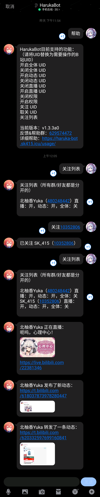

  
   
  

	
# nonebot-plugin-bililive

_✨ 将 B 站 UP 主动态与直播推送到 QQ 的 NoneBot2 插件 ✨_

## 📖 介绍

BiliLive 是一个基于 NoneBot2 的 B 站推送插件，支持将 UP 主的直播与动态消息推送到 QQ 群或私聊场景。

目前支持的适配器：OneBot V11。

### 特性

- 支持按 UP 主维度分别开启或关闭动态、直播推送。
- 支持群内管理员权限控制，限制机器人使用范围。
- 支持直播或动态推送时尝试 @全体成员。
- 支持多 Bot 推送失败回退与基础异常清理。
- 支持 Playwright 截图与验证码服务接入。

## 💿 安装

使用 nb-cli 安装

在 NoneBot2 项目根目录执行：

	nb plugin install nonebot-plugin-bililive

使用包管理器安装

在 NoneBot2 项目虚拟环境中安装：

    pip install nonebot-plugin-bililive

然后在 NoneBot2 项目根目录的 pyproject.toml 中加载插件：

	[tool.nonebot]
	plugins = ["nonebot_plugin_bililive"]

首次使用动态截图功能时，插件会自动检查并安装 Chromium。插件数据目录统一由 nonebot-plugin-localstore 提供，无需再单独配置数据目录。

## ⚙️ 配置

在 NoneBot2 项目的 .env 文件中按需添加配置项：

| 配置项 | 必填 | 默认值 | 说明 |
|:-----:|:----:|:----:|:----|
| BILILIVE_TO_ME | 否 | true | 是否需要 @机器人 或命令前缀触发 |
| BILILIVE_PROXY | 否 | 无 | HTTP 代理地址，用于 B 站请求和 Playwright 下载 |
| BILILIVE_INTERVAL | 否 | 10 | 默认轮询间隔，单位秒 |
| BILILIVE_LIVE_INTERVAL | 否 | 10 | 直播轮询间隔，单位秒 |
| BILILIVE_DYNAMIC_INTERVAL | 否 | 0 | 动态轮询间隔，单位秒，0 表示使用默认逻辑 |
| BILILIVE_DYNAMIC_AT | 否 | false | 动态推送时是否尝试 @全体 |
| BILILIVE_LIVE_OFF_NOTIFY | 否 | false | 是否推送下播通知 |
| BILILIVE_CAPTCHA_ADDRESS | 否 | https://captcha-cd.ngworks.cn | 验证码识别服务地址 |
| BILILIVE_CAPTCHA_TOKEN | 否 | bililive | 验证码服务 token |
| BILILIVE_DYNAMIC_TIMEOUT | 否 | 30 | 动态截图超时时间，单位秒 |
| BILILIVE_DYNAMIC_FONT_SOURCE | 否 | system | 截图字体来源 |
| BILILIVE_DYNAMIC_FONT | 否 | Noto Sans CJK SC | 截图字体 |
| BILILIVE_DYNAMIC_BIG_IMAGE | 否 | false | 是否优先展示大图 |
| BILILIVE_COMMAND_PREFIX | 否 | 空字符串 | 命令额外前缀 |
| BILILIVE_CHROMIUM_ENDPOINT | 否 | 无 | 外部 Chromium CDP 地址，如 `http://127.0.0.1:9222` |

动态抓取优先使用 `BILILIVE_CHROMIUM_ENDPOINT` 连接的外部 Chromium；未配置时使用 Playwright 持久化浏览器中的 cookies 请求网页动态接口。若某些 UID 持续抓取失败，建议在外部 Chromium 或插件浏览器数据目录中登录常用 B 站账号，以降低风控概率。

## 🎉 使用

### 指令表

| 指令 | 权限 | 需要@ | 范围 | 说明 |
|:-----:|:----:|:----:|:----:|:----|
| 帮助 | 群员 | 视 BILILIVE_TO_ME 而定 | 群聊/私聊 | 查看帮助信息 |
| 关注 UID | 群员/管理员 | 视 BILILIVE_TO_ME 而定 | 群聊/私聊 | 订阅指定 UP |
| 取关 UID | 群员/管理员 | 视 BILILIVE_TO_ME 而定 | 群聊/私聊 | 取消订阅 |
| 关注列表 | 群员/管理员 | 视 BILILIVE_TO_ME 而定 | 群聊/私聊 | 查看当前订阅 |
| 开启直播 UID | 群员/管理员 | 视 BILILIVE_TO_ME 而定 | 群聊/私聊 | 开启某 UP 的直播推送 |
| 关闭直播 UID | 群员/管理员 | 视 BILILIVE_TO_ME 而定 | 群聊/私聊 | 关闭某 UP 的直播推送 |
| 开启动态 UID | 群员/管理员 | 视 BILILIVE_TO_ME 而定 | 群聊/私聊 | 开启某 UP 的动态推送 |
| 关闭动态 UID | 群员/管理员 | 视 BILILIVE_TO_ME 而定 | 群聊/私聊 | 关闭某 UP 的动态推送 |
| 开启全体 UID | 管理员 | 视 BILILIVE_TO_ME 而定 | 群聊 | 开启直播推送 @全体 |
| 关闭全体 UID | 管理员 | 视 BILILIVE_TO_ME 而定 | 群聊 | 关闭直播推送 @全体 |
| 开启权限 | 管理员 | 视 BILILIVE_TO_ME 而定 | 群聊 | 限制仅管理员可使用 |
| 关闭权限 | 管理员 | 视 BILILIVE_TO_ME 而定 | 群聊 | 关闭管理员权限限制 |
| 已开播 | 群员/管理员 | 视 BILILIVE_TO_ME 而定 | 群聊/私聊 | 查看已开播关注列表 |

### 效果图

## 开发

本仓库保留了本地开发启动方式：

	python bot.py

用于发布的插件入口模块为：

	nonebot_plugin_bililive

## 致谢

- [NoneBot2](https://github.com/nonebot/nonebot2)
- [go-cqhttp](https://github.com/Mrs4s/go-cqhttp)
- [bilibili-API-collect](https://github.com/SocialSisterYi/bilibili-API-collect)
- [bilireq](https://github.com/SK-415/bilireq)

## 许可证

本项目使用 [GNU AGPLv3](https://choosealicense.com/licenses/agpl-3.0/) 作为开源许可证。
